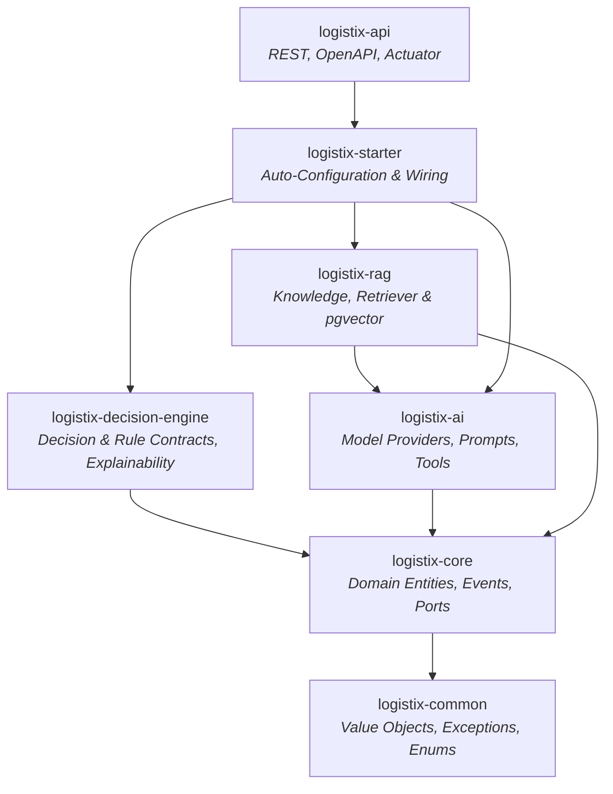

# LogistiX

> **Open Source AI Platform for Logistics & Transportation**
> *Explainable Decision Intelligence for Modern Supply Chains*

[](https://opensource.org/licenses/Apache-2.0)
[](https://openjdk.org/projects/jdk/21/)
[](https://spring.io/projects/spring-boot)
[](https://spring.io/projects/spring-ai)
[](https://github.com/pgvector/pgvector)

---

## 🚀 Mission

LogistiX is an extensible open-source AI platform engineered for logistics and freight transportation. Modern supply chain systems require rapid optimization combined with transparent, auditable decision intelligence. LogistiX provides an enterprise-ready foundation supporting **AI-assisted driver dispatch**, dynamic routing, automated pricing, ETA prediction, carrier recommendations, Retrieval-Augmented Generation (RAG), and multi-agent coordination.

---

## 🏛️ Architecture Principles

- **Hexagonal Architecture (Ports & Adapters)**: Domain core is isolated from databases, LLM vendors, and web frameworks.
- **Explainable Decision Intelligence**: Every AI-driven recommendation includes mathematical confidence, feature contributions, and business rule justifications.
- **Constructor Injection Only**: Pure immutable state with zero field injection.
- **Clean Contracts & Java 21 Records**: Strongly-typed immutable value objects and domain events.
- **Zero Circular Dependencies**: Strict acyclic dependency graph across all modules.

---

## 📐 Architecture Overview



---

## 📂 Repository Structure

```
LogistiX/
├── backend/
│   ├── pom.xml                        # Master Parent POM (Java 21, Dependency Management)
│   ├── logistix-common/               # Shared DTOs, Enums, Exceptions, Utilities (Pure Java 21)
│   ├── logistix-core/                 # Domain Entities, Value Objects, Domain Events, Ports (SPIs)
│   ├── logistix-decision-engine/      # Decision Engine, Rule Engine, Explainability Models
│   ├── logistix-ai/                   # AI Provider Abstractions, Prompts, Tool Calling
│   ├── logistix-rag/                  # Knowledge Ingestion, Retriever, Embedding & Vector Store SPI
│   ├── logistix-starter/              # Spring Boot AutoConfiguration & Properties
│   └── logistix-api/                  # REST Controllers, OpenAPI 3, Global Exception Handling
├── frontend/                          # Dispatcher UI & Map Visualizers (Reserved)
├── datasets/                          # Benchmark Logistics Datasets & Telemetry Schemas
├── training/                          # Fine-tuning recipes & offline ML pipelines
├── docs/                              # Project Documentation & Architecture Guides
├── architecture/                      # Architectural specs, C4 diagrams, and ADRs
│   └── ADRs/                          # Architecture Decision Records
├── docker/
│   ├── docker-compose.yml             # PostgreSQL 17 + pgvector service
│   └── postgres/
│       └── 01-init-pgvector.sql       # Vector extension initialization script
├── examples/                          # API Request samples & scenario configurations
└── .github/
    └── workflows/
        └── ci.yml                     # GitHub Actions CI Workflow
```

---

## 📦 Backend Module Responsibilities

| Module | Purpose | Coupling |
| :--- | :--- | :--- |
| **`logistix-common`** | Common value objects (`Coordinates`, `Money`, `EntityId`), standard exceptions, enums, and validators. | Pure Java 21 |
| **`logistix-core`** | Core logistics entities (`Shipment`, `Driver`, `Route`, `Vehicle`), Domain Events, and Inbound/Outbound Ports. | Pure Java 21 |
| **`logistix-decision-engine`** | Explainable decision contracts, multi-criteria scoring, and business rule engine abstractions. | Pure Java 21 |
| **`logistix-ai`** | Foundation model provider contracts, prompt templates, and LLM tool calling abstractions. | Spring AI Core |
| **`logistix-rag`** | Knowledge chunking, embedding generation, similarity query models, and pgvector store integration. | Spring AI, pgvector |
| **`logistix-starter`** | Spring Boot `@AutoConfiguration`, `@ConfigurationProperties` binding, and IoC wiring. | Spring Boot Starter |
| **`logistix-api`** | Executable REST API application, Springdoc OpenAPI documentation, Actuator telemetry, and RFC 7807 handler. | Spring Web / Springdoc |

---

## 🛠️ Getting Started & Build Instructions

### Prerequisites
- **JDK 21** or higher (Eclipse Temurin, OpenJDK, or GraalVM)
- **Maven 3.8+**
- **Docker & Docker Compose**

### 1. Start Infrastructure (PostgreSQL + pgvector)

```bash
cd docker
docker compose up -d
```

Verify that PostgreSQL and the `pgvector` extension are active:
```bash
docker compose ps
```

### 2. Build Backend Modules

```bash
cd backend
mvn clean install
```

### 3. Run the API Application

```bash
cd backend/logistix-api
mvn spring-boot:run
```

Once started:
- **Interactive OpenAPI / Swagger UI**: [http://localhost:8080/swagger-ui.html](http://localhost:8080/swagger-ui.html)
- **OpenAPI Schema Definition**: [http://localhost:8080/api-docs](http://localhost:8080/api-docs)
- **System Health Status**: [http://localhost:8080/api/v1/system/health](http://localhost:8080/api/v1/system/health)
- **Actuator Telemetry**: [http://localhost:8080/actuator](http://localhost:8080/actuator)

---

## 📄 License

LogistiX is open-source software licensed under the [Apache License, Version 2.0](LICENSE).
