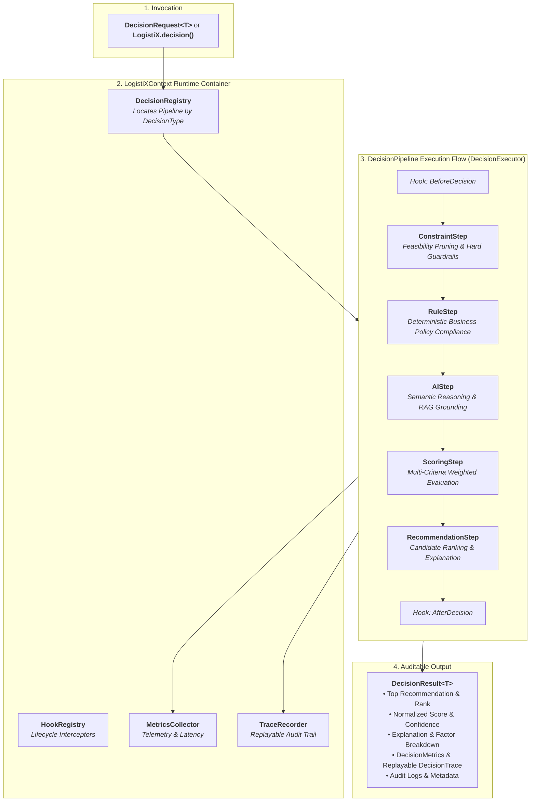

# LogistiX

> **Open Source Framework for AI-Powered Operational Decision Making**
> *Explainable, Multi-Criteria Decision Intelligence with Fluent DSL & Spring Boot Integration*

[](https://opensource.org/licenses/Apache-2.0)
[](https://openjdk.org/projects/jdk/21/)
[](https://spring.io/projects/spring-boot)
[](https://spring.io/projects/spring-ai)
[](https://github.com/pgvector/pgvector)

---

## 🚀 Mission & Vision

**LogistiX** is an extensible open-source framework for building **AI-powered operational decision systems**.

Inspired by the developer ergonomics of **Spring Boot**, the pipeline flexibility of **LangGraph**, the resiliency of **Temporal**, and the declarative fluency of **Apache Camel**, LogistiX empowers engineers to assemble multi-stage decision pipelines that combine:
- **Deterministic Hard Constraints & Feasibility Guardrails**
- **Business Policy Rules with Explicit Precedence**
- **AI / LLM Semantic Reasoning & RAG Retrieval**
- **Multi-Criteria Normalized Scoring & Explainability**

---

## ⚡ Quick Start: Hello World in 4 Lines

With `logistix-dsl`, running a decision requires zero boilerplate:

```java
import org.logistix.dsl.LogistiX;
import org.logistix.domain.decision.DecisionResult;

public class App {
    public static void main(String[] args) {
        DecisionResult<String> result = LogistiX.<String>decision("driver-dispatch")
                .fact("shipmentId", "SHIP-9901")
                .fact("origin", "Chicago, IL")
                .fact("destination", "Detroit, MI")
                .fact("weightLbs", 18500)
                .execute();

        System.out.println("Recommended Option: " + result.recommendation().item());
        System.out.println("Normalized Score: " + result.score().value());
        System.out.println("Confidence: " + result.confidence());
        System.out.println("Explanation: " + result.explanation().summary());
    }
}
```

---

## 🏗️ Assembling Pipelines with Fluent DSL

```java
// 1. Build an immutable decision pipeline
DecisionPipeline pipeline = LogistiX.pipeline("carrier-recommendation")
    .name("Standard-Carrier-Selection")
    .version("1.0.0")
    .step(new CarrierAvailabilityConstraintStep())
    .step(new ServiceLevelAgreementRuleStep())
    .step(new RouteRiskAiStep())
    .step(new MultiCriteriaScoringStep())
    .step(new ExplainableRecommendationStep())
    .build();

// 2. Register pipeline in the runtime container
LogistiX.getContext().getDecisionRegistry().register(pipeline);

// 3. Execute decision
DecisionResult<Carrier> result = LogistiX.<Carrier>decision("carrier-recommendation")
    .fact("lane", "LAX -> JFK")
    .execute();
```

---

## 🏷️ Declarative Annotations

LogistiX provides clean annotations for declarative component declaration:

```java
@DecisionRule(id = "RULE-PREMIUM-SLA", name = "Tier-1 Priority Boost", priority = 10)
public class PremiumCarrierRule implements Rule<CarrierCandidate> {
    @Override
    public RuleOutcome evaluate(CarrierCandidate carrier, DecisionContext context) {
        if ("TIER_1".equals(carrier.tier())) {
            return RuleOutcome.passed("RULE-PREMIUM-SLA", "Tier-1 Priority Boost", "Qualified for priority", 0.15);
        }
        return RuleOutcome.passed("RULE-PREMIUM-SLA", "Tier-1 Priority Boost", "Standard evaluation");
    }
}
```

- **`@DecisionPipeline("decision-type")`**: Declares a pipeline bean.
- **`@DecisionRule(id = "...", priority = 1)`**: Declares a business rule with priority.
- **`@DecisionConstraint(id = "...", severity = HARD)`**: Declares an operational guardrail.
- **`@DecisionPlugin(id = "...")`**: Declares a pluggable framework extension.

---

## 🍃 Spring Boot Auto-Configuration

Include `logistix-spring-boot-starter` in your `pom.xml`:

```xml
<dependency>
    <groupId>org.logistix</groupId>
    <artifactId>logistix-spring-boot-starter</artifactId>
    <version>0.1.0-SNAPSHOT</version>
</dependency>
```

Spring Boot automatically scans and registers all `@DecisionPipeline`, `@DecisionRule`, `@DecisionConstraint`, and `@DecisionPlugin` beans into `LogistiXContext` on startup!

### Configuration Properties (`application.yml`)

```yaml
logistix:
  enabled: true
  default-timeout: 10s
  trace-level: DETAILED
  strict-constraints: true
  fail-fast-on-rule-error: false
  auto-discovery: true
```

---

## 📐 Architecture & Decision Flow



---

## 📂 Repository Structure

```
LogistiX/
├── backend/
│   ├── pom.xml                        # Master Parent POM (Java 21, Dependency Management)
│   ├── logistix-common/               # Shared Value Objects, Exceptions, Utilities (Pure Java 21)
│   ├── logistix-domain/               # Pure Domain Layer: DecisionContext, Facts, Rules, Ports
│   ├── logistix-engine/               # Framework Execution Runtime: Pipelines, Steps, Traces, Plugins
│   ├── logistix-dsl/                  # Public API Facade, Fluent DSLs, Annotations, Builders, CLI
│   ├── logistix-decision-engine/      # Composite Pipeline Orchestrators & Strategy Registry
│   ├── logistix-ai/                   # AI Provider Abstractions, Prompts, Tool Calling via Spring AI
│   ├── logistix-rag/                  # Knowledge Ingestion, Retrievers & pgvector Integration
│   ├── logistix-simulation/           # Synthetic Fleet, Demand, Weather & Traffic Simulators
│   ├── logistix-benchmark/            # Model, Rule Engine, and Decision Pipeline Evaluators
│   ├── logistix-spring-boot-starter/  # Spring Boot AutoConfiguration, Scanning & Properties Binding
│   ├── logistix-starter/              # Core Starter Wiring
│   └── logistix-api/                  # REST Gateway, OpenAPI 3, and Global Exception Handling
├── examples/                          # Self-contained executable code samples & tutorials
├── frontend/                          # Dispatcher UI & Map Visualizers (Reserved)
├── datasets/                          # Benchmark Logistics Datasets & Telemetry Schemas
├── training/                          # Fine-tuning recipes & offline ML pipelines
├── docs/                              # Project Documentation & Architecture Guides
├── architecture/                      # Architectural specs, C4 diagrams, and ADRs
│   └── ADRs/                          # Architecture Decision Records
└── docker/
    ├── docker-compose.yml             # PostgreSQL 17 + pgvector service
    └── postgres/
        └── 01-init-pgvector.sql       # Vector extension initialization script
```

---

## 🛠️ Build & Verification

```bash
cd backend
mvn clean test-compile
```

---

## 📄 License

LogistiX is open-source software licensed under the [Apache License, Version 2.0](LICENSE).
