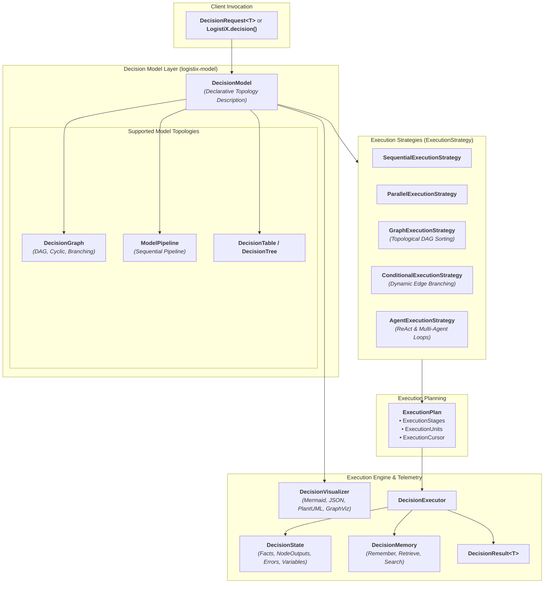

# LogistiX

> **Open Source Decision Intelligence Platform for Operational Excellence**
> *Explainable, Multi-Strategy AI Decision Modeling for Supply Chains & Beyond*

[](https://opensource.org/licenses/Apache-2.0)
[](https://openjdk.org/projects/jdk/21/)
[](https://spring.io/projects/spring-boot)
[](https://spring.io/projects/spring-ai)
[](https://github.com/pgvector/pgvector)

---

## 🚀 Mission & Vision

**LogistiX** is an extensible open-source **Decision Intelligence Platform** for modeling, executing, and explaining complex operational decisions.

LogistiX decouples **Decision Modeling** (describing *what* needs to be evaluated) from **Execution Strategy** (determining *how* and in what topology computation happens).

### Multi-Strategy Decision Execution
- 🔄 **Sequential Pipelines**: Linear multi-step decision chains.
- ⚡ **Parallel Execution**: Concurrent evaluation of independent analytical criteria.
- 🕸️ **Decision Graphs (DAGs)**: Topological dependency resolution with conditional branching.
- 🤖 **Agentic & ReAct Loops**: Autonomous multi-agent coordination and reflective decision making.

---

## ⚡ Quick Start: Hello World in 4 Lines

With `logistix-dsl`, executing an operational decision requires zero ceremony:

```java
import org.logistix.dsl.LogistiX;
import org.logistix.domain.decision.DecisionResult;

public class App {
    public static void main(String[] args) {
        DecisionResult<String> result = LogistiX.<String>decision("driver-dispatch")
                .fact("shipmentId", "SHIP-9901")
                .fact("origin", "Chicago, IL")
                .fact("destination", "Detroit, MI")
                .fact("weightLbs", 18500)
                .execute();

        System.out.println("Recommended Option: " + result.recommendation().item());
        System.out.println("Normalized Score: " + result.score().value());
        System.out.println("Confidence: " + result.confidence());
        System.out.println("Explanation: " + result.explanation().summary());
    }
}
```

---

## 🕸️ Decision Graph Topology Assembly

Assemble non-linear, branching decision graphs with the fluent Graph DSL:

```java
DecisionGraph graph = LogistiX.graph("carrier-intelligence-graph")
    .name("Carrier Multi-Branch Evaluation")
    .addNode(DecisionGraphNode.of("hos-check", "Driver Hours of Service", NodeType.CONSTRAINT))
    .addNode(DecisionGraphNode.of("weather-risk", "Weather Impact AI", NodeType.AI))
    .addNode(DecisionGraphNode.of("traffic-delay", "Congestion Prediction AI", NodeType.AI))
    .addNode(DecisionGraphNode.of("scoring", "Multi-Criteria Scoring", NodeType.SCORING, List.of("weather-risk", "traffic-delay")))
    .addNode(DecisionGraphNode.of("recommendation", "Synthesize Output", NodeType.RECOMMENDATION, List.of("scoring")))
    .addEdge("hos-check", "weather-risk")
    .addEdge("hos-check", "traffic-delay")
    .addEdge("weather-risk", "scoring")
    .addEdge("traffic-delay", "scoring")
    .addEdge("scoring", "recommendation")
    .build();

// Render model to Mermaid diagram
String mermaid = LogistiX.visualizer().toMermaid(graph);
```

---

## 📜 Declarative YAML DSL

```yaml
decision:
  name: dynamic-driver-dispatch
  strategy: graph
  version: 1.0.0
  nodes:
    - id: hos-guardrail
      type: CONSTRAINT
    - id: weather-inference
      type: AI
    - id: congestion-model
      type: AI
    - id: multi-criteria-scorer
      type: SCORING
      dependencies: [weather-inference, congestion-model]
    - id: dispatch-recommendation
      type: RECOMMENDATION
      dependencies: [multi-criteria-scorer]
  edges:
    - source: hos-guardrail
      target: weather-inference
    - source: hos-guardrail
      target: congestion-model
    - source: weather-inference
      target: multi-criteria-scorer
    - source: congestion-model
      target: multi-criteria-scorer
    - source: multi-criteria-scorer
      target: dispatch-recommendation
```

---

## 🍃 Spring Boot Auto-Configuration

Add `logistix-spring-boot-starter` to your `pom.xml`:

```xml
<dependency>
    <groupId>org.logistix</groupId>
    <artifactId>logistix-spring-boot-starter</artifactId>
    <version>0.1.0-SNAPSHOT</version>
</dependency>
```

Spring Boot automatically discovers all `@DecisionPipeline`, `@DecisionRule`, `@DecisionConstraint`, and `@DecisionPlugin` components and populates the runtime container on startup!

---

## 🏛️ Decision Intelligence Platform Architecture



---

## 📂 Repository Structure

```
LogistiX/
├── backend/
│   ├── pom.xml                        # Master Parent POM (Java 21, Multi-Module BOM)
│   ├── logistix-common/               # Shared Value Objects, Exceptions, Utilities (Pure Java 21)
│   ├── logistix-domain/               # Pure Domain Layer: DecisionContext, Facts, Rules, Ports
│   ├── logistix-model/                # Decision Modeling: DecisionGraph, Nodes, Edges, State, Memory
│   ├── logistix-engine/               # Framework Execution Runtime: Pipelines, Steps, Traces, Plugins
│   ├── logistix-dsl/                  # Public API Facade, Fluent DSLs, Annotations, Builders, CLI
│   ├── logistix-decision-engine/      # Composite Pipeline Orchestrators & Strategy Registry
│   ├── logistix-ai/                   # AI Provider Abstractions, Prompts, Tool Calling via Spring AI
│   ├── logistix-rag/                  # Knowledge Ingestion, Retrievers & pgvector Integration
│   ├── logistix-simulation/           # Synthetic Fleet, Demand, Weather & Traffic Simulators
│   ├── logistix-benchmark/            # Model, Rule Engine, and Decision Pipeline Evaluators
│   ├── logistix-spring-boot-starter/  # Spring Boot AutoConfiguration, Scanning & Properties Binding
│   ├── logistix-starter/              # Core Starter Wiring
│   └── logistix-api/                  # REST Gateway, OpenAPI 3, and Global Exception Handling
├── examples/                          # Self-contained executable code samples & tutorials
├── frontend/                          # Dispatcher UI & Map Visualizers (Reserved)
├── datasets/                          # Benchmark Logistics Datasets & Telemetry Schemas
├── training/                          # Fine-tuning recipes & offline ML pipelines
├── docs/                              # Project Documentation & Architecture Guides
├── architecture/                      # Architectural specs, C4 diagrams, and ADRs
│   └── ADRs/                          # Architecture Decision Records
└── docker/
    ├── docker-compose.yml             # PostgreSQL 17 + pgvector service
    └── postgres/
        └── 01-init-pgvector.sql       # Vector extension initialization script
```

---

## 🛠️ Build & Verification

```bash
cd backend
mvn clean test-compile
```

---

## 📄 License

LogistiX is open-source software licensed under the [Apache License, Version 2.0](LICENSE).
