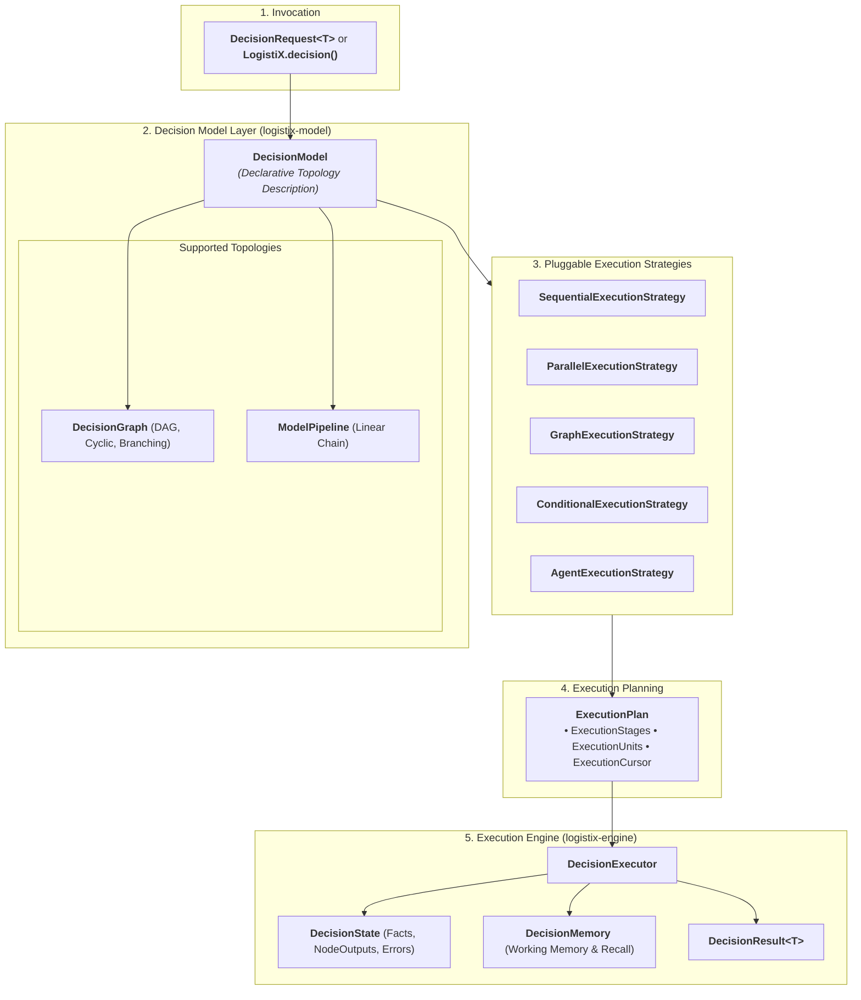

# LogistiX

> **Open Source Decision Intelligence Framework for Operational Systems**  
> *Multi-Strategy AI Decision Modeling, Deterministic Guardrails & Explainable Intelligence*

[](https://openjdk.org/projects/jdk/21/)
[](https://spring.io/projects/spring-boot)
[](https://maven.apache.org/)
[](LICENSE)
[]()
[](docs/)

---

## ⚡ What is LogistiX?

**LogistiX** is a high-performance Java 21 framework for building, executing, and explaining mission-critical operational decisions. It decouples **Decision Modeling** (describing *what* needs to be evaluated) from **Execution Strategy** (determining *how* computation happens—whether via linear pipelines, parallel multi-criteria scoring, topological DAGs, or autonomous multi-agent reasoning).

---

## 🚀 Quick Start: Hello World in Under 1 Minute

With `logistix-dsl`, executing an operational decision requires zero boilerplate:

```java
import org.logistix.dsl.LogistiX;
import org.logistix.domain.decision.DecisionResult;

public class QuickStart {
    public static void main(String[] args) {
        DecisionResult<String> result = LogistiX.<String>decision("driver-dispatch")
                .fact("shipmentId", "SHIP-9901")
                .fact("origin", "Chicago, IL")
                .fact("destination", "Detroit, MI")
                .fact("weightLbs", 18500)
                .execute();

        System.out.println("Selected Candidate: " + result.recommendation().item());
        System.out.println("Objective Score:    " + result.score().value());
        System.out.println("Confidence:         " + result.confidence());
        System.out.println("Explainability:     " + result.explanation().summary());
    }
}
```

---

## 💡 What You Can Build

LogistiX is domain-agnostic and powers high-stakes operational workflows across logistics and supply chain:

- 🚚 **Autonomous Driver Dispatch**: Real-time load matching with Hours of Service (HOS) and weight guardrails.
- 🏢 **Carrier Selection & Scoring**: Multi-criteria SLA scoring balancing freight cost, reliability, and lane volatility.
- ⏱️ **Predictive ETA & Rerouting**: Combining weather forecasts, live telematics, and LLM reasoning.
- 💰 **Dynamic Freight Pricing**: Spot market rate quotation based on lane capacity elasticity.
- 🏭 **Dock & Yard Scheduling**: Constrained bay door scheduling for warehouse management.
- 🛡️ **Fraud & Anomaly Detection**: Identifying GPS spoofing, phantom loads, and route deviations.
- 🤖 **Autonomous Multi-Agent Negotiation**: Coordinated bargaining between shipper and carrier agents.

---

## 🌟 Core Framework Features

- 🛡️ **Deterministic Guardrails**: Hard constraints and compliance rules always validate prior to AI suggestions.
- 🔍 **Explainability First**: Every decision generates an audit-ready, feature-attributed explanation.
- 🕸️ **Multi-Strategy Topologies**: Seamlessly switch between Linear Pipelines, Concurrent Fans, Topological DAGs, and ReAct Agent Loops without changing business logic.
- 🍃 **Spring Boot Auto-Discovery**: Automatic discovery of `@DecisionPipeline`, `@DecisionRule`, and `@DecisionPlugin` beans.
- 📊 **Model Visualizer**: Export decision graphs directly to Mermaid diagrams, JSON schemas, PlantUML, or GraphViz.
- 📜 **Declarative YAML DSL**: Author decision topologies with zero code in YAML.
- ☕ **Pure Java 21 Foundation**: Built on Records, Sealed Interfaces, Pattern Matching, and virtual threads.

---

## 🕸️ Decision Graph Example

Assemble multi-branch DAG decision networks using the fluent Graph DSL:

```java
DecisionGraph graph = LogistiX.graph("carrier-intelligence-graph")
    .name("Carrier Multi-Branch Evaluation")
    .addNode(DecisionGraphNode.of("hos-check", "Driver Hours of Service", NodeType.CONSTRAINT))
    .addNode(DecisionGraphNode.of("weather-risk", "Weather Impact AI", NodeType.AI))
    .addNode(DecisionGraphNode.of("traffic-delay", "Congestion Prediction AI", NodeType.AI))
    .addNode(DecisionGraphNode.of("scoring", "Multi-Criteria Scoring", NodeType.SCORING, List.of("weather-risk", "traffic-delay")))
    .addNode(DecisionGraphNode.of("recommendation", "Synthesize Output", NodeType.RECOMMENDATION, List.of("scoring")))
    .addEdge("hos-check", "weather-risk")
    .addEdge("hos-check", "traffic-delay")
    .addEdge("weather-risk", "scoring")
    .addEdge("traffic-delay", "scoring")
    .addEdge("scoring", "recommendation")
    .build();

// Render model directly to a Mermaid flowchart
String mermaid = LogistiX.visualizer().toMermaid(graph);
```

---

## 🚚 Golden Reference Capability: AI-Assisted Driver Dispatch

LogistiX includes a production-grade **Commercial Driver Dispatch Golden Reference Capability** (`logistix-examples`) implementing our core architectural principle:
> *"The AI can reason. LogistiX decides."*

### Architectural Invariants:
1. **Hard Constraints First**: Prunes non-compliant drivers (HOS, weight/volume limits, endorsements, deadline) deterministically before scoring or AI involvement.
2. **Deterministic Scoring Authority**: Multi-criteria weighted scoring (Deadhead proximity, ETA SLA buffer, driver rating, trip cost efficiency, business rules) retains sole mathematical authority over ranking.
3. **Single-Call Batched AI Evaluation**: Evaluates top-N feasible candidate pairings in **exactly ONE batched Spring AI invocation** (`DispatchAIRequest`), optimizing latency and API costs.
4. **Typed Telemetry & Fail-Safe Fallback**: Captures execution latency, invocation count (=1), prompt version (`DRIVER_DISPATCH_AI_PROMPT_V1`), provider type (`LIVE` vs `MOCK`), with automated fallback to deterministic ranking upon timeout.

```bash
# Run Golden Reference Demo & Benchmark
mvn exec:java -Dexec.mainClass="org.logistix.examples.dispatch.DriverDispatchReferenceApp" -pl :logistix-examples
```

---

## 🏛️ Framework Architecture



---

## 🗺️ Project Roadmap

| Phase | Milestone | Focus Areas | Status |
| :--- | :--- | :--- | :--- |
| **Sprint 1** | Project Foundation | Java 21, Hexagonal Architecture, Multi-Module BOM | ✅ Completed |
| **Sprint 2** | Domain Layer & SPIs | Pure Domain Model, FactBag, DecisionContext, Outbound Ports | ✅ Completed |
| **Sprint 3** | Execution Engine | DecisionPipeline, Step Lifecycles, Telemetry Traces, Plugins | ✅ Completed |
| **Sprint 4** | Developer Experience | Fluent DSL (`LogistiX`), Annotations, Spring Boot Starter | ✅ Completed |
| **Sprint 5** | Decision Intelligence | DecisionModel, DecisionGraph, Pluggable ExecutionStrategies | ✅ Completed |
| **Sprint 6** | Framework Hardening | Module Consolidation, Stability Matrix, Constitution (RC2) | ✅ Completed |
| **Sprint 7** | Dispatch Capability | Production AI-Assisted Driver Dispatching Implementation | ⏳ Upcoming |

---

## 🤝 Contributing

We welcome contributions from the community! Please read:
- 📜 [Framework Constitution](docs/CONSTITUTION.md) for our 10 engineering principles.
- 🛡️ [API Stability Matrix](docs/API_STABILITY.md) before proposing API modifications.
- 📘 [Contributing Guide](CONTRIBUTING.md) for local environment setup and pull request workflows.

---

## 📄 License

LogistiX is open-source software licensed under the [Apache License, Version 2.0](LICENSE).
