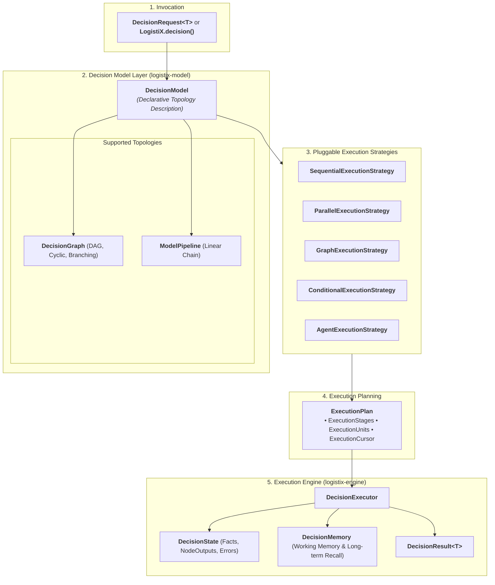

# LogistiX

> **Open Source Decision Intelligence Platform for Operational Systems**
> *Multi-Strategy AI Decision Modeling, Deterministic Guardrails & Explainable Intelligence*

[](https://opensource.org/licenses/Apache-2.0)
[](https://openjdk.org/projects/jdk/21/)
[](https://spring.io/projects/spring-boot)
[](https://spring.io/projects/spring-ai)
[](https://github.com/pgvector/pgvector)

---

## 💡 What You Can Build with LogistiX

LogistiX is a domain-agnostic **Decision Intelligence Platform** built for high-stakes operational environments:

- 🚚 **Autonomous Driver Dispatch**: Real-time load matching with Hours of Service (HOS) and weight guardrails.
- 🏢 **Carrier Selection & Routing**: Multi-criteria SLA scoring balancing freight cost, reliability, and lane volatility.
- ⏱️ **Predictive ETA & Rerouting**: Combining weather forecasts, live telematics, and LLM reasoning.
- 💰 **Dynamic Freight Pricing**: Spot market rate quotation based on lane capacity elasticity.
- 🏭 **Dock & Yard Scheduling**: Constrained bay door scheduling for warehouse management.
- 🛡️ **Fraud & Anomaly Detection**: Identifying GPS spoofing, phantom loads, and route deviations.
- 🤖 **Autonomous Multi-Agent Negotiation**: Coordinated bargaining between shipper and carrier agents.

---

## ⚡ Quick Start: Hello World in 4 Lines

With `logistix-dsl`, running a decision requires zero ceremony:

```java
import org.logistix.dsl.LogistiX;
import org.logistix.domain.decision.DecisionResult;

public class App {
    public static void main(String[] args) {
        DecisionResult<String> result = LogistiX.<String>decision("driver-dispatch")
                .fact("shipmentId", "SHIP-9901")
                .fact("origin", "Chicago, IL")
                .fact("destination", "Detroit, MI")
                .fact("weightLbs", 18500)
                .execute();

        System.out.println("Recommended Option: " + result.recommendation().item());
        System.out.println("Normalized Score: " + result.score().value());
        System.out.println("Confidence: " + result.confidence());
        System.out.println("Explanation: " + result.explanation().summary());
    }
}
```

---

## 🕸️ Decision Graph Topology

Model complex multi-branch decision topologies using the fluent Graph DSL:

```java
DecisionGraph graph = LogistiX.graph("carrier-intelligence-graph")
    .name("Carrier Multi-Branch Evaluation")
    .addNode(DecisionGraphNode.of("hos-check", "Driver Hours of Service", NodeType.CONSTRAINT))
    .addNode(DecisionGraphNode.of("weather-risk", "Weather Impact AI", NodeType.AI))
    .addNode(DecisionGraphNode.of("traffic-delay", "Congestion Prediction AI", NodeType.AI))
    .addNode(DecisionGraphNode.of("scoring", "Multi-Criteria Scoring", NodeType.SCORING, List.of("weather-risk", "traffic-delay")))
    .addNode(DecisionGraphNode.of("recommendation", "Synthesize Output", NodeType.RECOMMENDATION, List.of("scoring")))
    .addEdge("hos-check", "weather-risk")
    .addEdge("hos-check", "traffic-delay")
    .addEdge("weather-risk", "scoring")
    .addEdge("traffic-delay", "scoring")
    .addEdge("scoring", "recommendation")
    .build();

// Render model directly to a Mermaid diagram
String mermaid = LogistiX.visualizer().toMermaid(graph);
```

---

## 🍃 Spring Boot Auto-Configuration

Include `logistix-spring-boot-starter` in your `pom.xml`:

```xml
<dependency>
    <groupId>org.logistix</groupId>
    <artifactId>logistix-spring-boot-starter</artifactId>
    <version>0.1.0-SNAPSHOT</version>
</dependency>
```

Spring Boot automatically discovers `@DecisionPipeline`, `@DecisionRule`, `@DecisionConstraint`, and `@DecisionPlugin` components upon application startup:

```java
@DecisionRule(id = "RULE-PREMIUM-SLA", name = "Tier-1 Priority Boost", priority = 10)
public class PremiumCarrierRule implements Rule<CarrierCandidate> {
    @Override
    public RuleOutcome evaluate(CarrierCandidate carrier, DecisionContext context) {
        if ("TIER_1".equals(carrier.tier())) {
            return RuleOutcome.passed("RULE-PREMIUM-SLA", "Tier-1 Priority Boost", "Qualified for priority", 0.15);
        }
        return RuleOutcome.passed("RULE-PREMIUM-SLA", "Tier-1 Priority Boost", "Standard evaluation");
    }
}
```

---

## 🏛️ Framework Philosophy & Architecture

LogistiX separates **Decision Modeling** (describing *what* needs to be evaluated) from **Execution Strategy** (determining *how* and in what topology computation happens).



---

## 📦 Consolidated Module Layout

```
LogistiX/
├── backend/
│   ├── pom.xml                        # Master Multi-Module POM (Java 21 BOM)
│   ├── logistix-common/               # Core Shared Value Objects & Domain Assertions (Pure Java 21)
│   ├── logistix-domain/               # Core Domain Layer: DecisionContext, Facts, Rules, Ports
│   ├── logistix-model/                # Decision Modeling: DecisionGraph, Nodes, Edges, State, Memory
│   ├── logistix-engine/               # Framework Runtime: Pipeline Orchestration, Traces, Plugins
│   ├── logistix-dsl/                  # Public API Entry Point, Fluent DSLs, Annotations, CLI
│   ├── logistix-ai/                   # AI Model Provider Adapter SPIs (Spring AI Integration)
│   ├── logistix-rag/                  # Knowledge Ingestion, Retrievers & pgvector Integration
│   ├── logistix-simulation/           # Synthetic Fleet, Demand, Weather & Traffic Simulators
│   ├── logistix-benchmark/            # Model, Rule Engine, and Decision Pipeline Evaluators
│   ├── logistix-spring-boot-starter/  # Spring Boot AutoConfiguration, Scanning & Properties Binding
│   └── logistix-api/                  # REST Gateway, OpenAPI 3, and Global Exception Handling
├── examples/                          # Self-contained executable code samples & tutorials
├── datasets/                          # Benchmark Logistics Datasets & Telemetry Schemas
├── training/                          # Fine-tuning recipes & offline ML pipelines
├── docs/                              # Project Documentation & Architecture Guides
├── architecture/                      # Architectural specs, C4 diagrams, and ADRs
│   └── ADRs/                          # Architecture Decision Records
└── docker/
    ├── docker-compose.yml             # PostgreSQL 17 + pgvector service
    └── postgres/
        └── 01-init-pgvector.sql       # Vector extension initialization script
```

---

## 🗺️ Roadmap & Stability Milestones

| Component / Layer | Stability Level | Stability Guarantee |
| :--- | :--- | :--- |
| **`LogistiX` (Public Facade & DSL)** | **STABLE (RC1)** | Zero breaking changes to fluent APIs (`decision()`, `pipeline()`, `graph()`, `context()`). |
| **`DecisionContext` & `FactBag`** | **STABLE (RC1)** | Immutable facts container API locked. |
| **`DecisionModel` & `DecisionGraph`** | **STABLE (RC1)** | Node/Edge topology contracts locked. |
| **`ExecutionStrategy` & `ExecutionPlan`** | **STABLE (RC1)** | Planning contracts locked. |
| **`DecisionPlugin` & Hooks SPI** | **STABLE (RC1)** | Lifecycle interceptor contracts locked. |
| **Outbound Provider SPIs** | **STABLE (RC1)** | `AIProvider`, `KnowledgeProvider`, `RuleProvider`, `ConstraintProvider` locked. |
| **Spring Boot Auto-Discovery** | **STABLE (RC1)** | Component scanning and `@Decision*` annotations locked. |

---

## 🛠️ Build & Verification

```bash
cd backend
mvn clean test-compile
```

---

## 🤝 Contributing

We welcome contributions! Please refer to the [Architecture Guidelines](architecture/ARCHITECTURE.md) and ensure that:
1. `mvn clean test-compile` passes with zero warnings.
2. New framework components adhere to Java 21 Records, Sealed Interfaces, and DDD purity.

---

## 📄 License

LogistiX is open-source software licensed under the [Apache License, Version 2.0](LICENSE).
