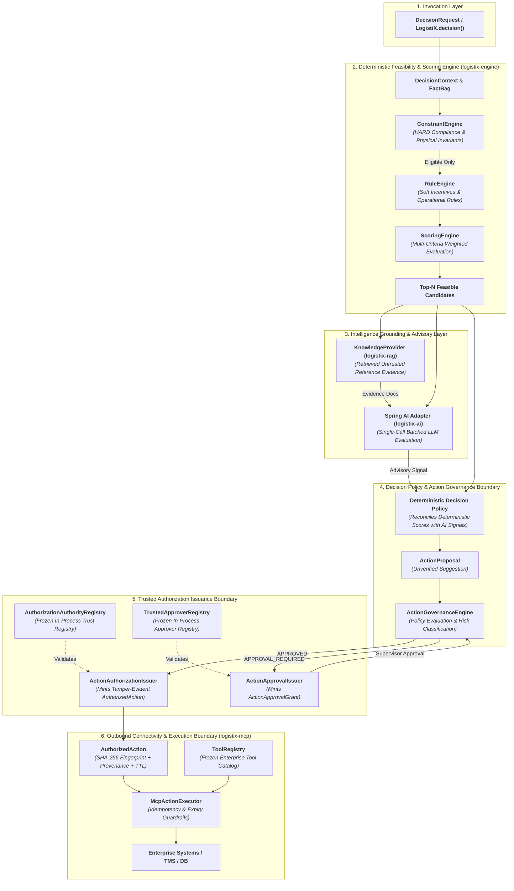

# LogistiX

> **Enterprise Decision Intelligence for Java**  
> *Deterministic Guardrails, Enterprise Knowledge Grounding, Spring AI Reasoning, and Governed Action Execution.*

[](https://openjdk.org/projects/jdk/21/)
[](https://spring.io/projects/spring-boot)
[](https://spring.io/projects/spring-ai)
[]()
[]()
[](https://github.com/venukommu/LogistiX/releases/tag/v0.1.0)
[](LICENSE)

---

## ⚡ What is LogistiX?

**LogistiX** is an open-source Java 21 Decision Intelligence framework for building explainable, governed, AI-assisted enterprise decision systems.

In mission-critical operations—such as commercial freight dispatch, dynamic routing, warehouse door allocation, and supply chain scheduling—raw AI models and autonomous LLM agents cannot be granted unconstrained write access or final decision authority.

LogistiX unites **deterministic operational policies** (hard constraints, compliance rules, mathematical scoring) with **probabilistic intelligence** (enterprise knowledge grounding, LLM reasoning) and **cryptographically verifiable action governance**:

```
Operational Data ──► Deterministic Constraints ──► Business Rules ──► Multi-Criteria Scoring
                                                                               │
Enterprise Systems ◄── MCP / Action Executor ◄── LogistiX Governance ◄── AI Advisory & Policy
```

---

## 🧭 Core Architectural Principles

> **"AI proposes. LogistiX governs. LogistiX authorizes. Only the exact authorized action executes."**

> **"Knowledge provides evidence. AI provides reasoning. MCP provides connectivity."**

1. **AI is Advisory, Never Authoritative**: AI models generate contextual suggestions (`ActionProposal`); they never make unilateral assignments or bypass business rules.
2. **HARD Constraints are Inviolable**: Physical, safety, and regulatory constraints (Hours of Service, weight limits, hazardous materials certifications) are evaluated deterministically. AI cannot resurrect disqualified candidates.
3. **Knowledge is Evidence, Not Authority**: Retrieved enterprise documents (`KnowledgeProvider`) are treated as untrusted reference context, protected against prompt injection and hallucinated citations.
4. **Deterministic Policy Retains Authority**: Final rankings, trade-off reconciliations, and action thresholds are computed by deterministic policy evaluators.
5. **Closed Authorization Boundary**: Outbound enterprise tools execute only tokenized, tamper-evident `AuthorizedAction` artifacts minted by trusted, frozen LogistiX issuance authorities.
6. **MCP is Connectivity, Not Governance**: The Model Context Protocol (MCP) acts strictly as an outbound execution adapter. MCP cannot formulate decisions, own trust registries, or bypass LogistiX governance.
7. **Every Decision is Auditable**: Telemetry is segregated (`AITelemetry`, `KnowledgeTelemetry`, `ActionTelemetry`), and every outcome produces a multi-layered explainability report.

---

## 🎯 What Problem Does LogistiX Solve?

Enterprises face a fundamental dilemma when adopting AI for operational decisions:

| Approach | Architecture | Strengths | Critical Weaknesses |
| :--- | :--- | :--- | :--- |
| **Traditional Rule Engines** | Hardcoded Rules & Heuristics | Deterministic, fast, 100% compliant | Brittle, blind to unstructured context (weather advisories, shipper notes), difficult to adapt to volatile operational conditions |
| **Direct LLM Applications** | App $\to$ Prompt $\to$ LLM $\to$ API Call | Adaptable, understands natural language context | Hallucinations, prompt injection vulnerabilities, non-deterministic latency, zero compliance guarantees, unsafe autonomous tool execution |
| **LogistiX Decision Intelligence** | Constraints $\to$ Rules $\to$ Scoring $\to$ Knowledge $\to$ AI $\to$ Policy $\to$ Governance $\to$ MCP | **Best of Both Worlds**: Deterministic safety + contextual AI intelligence + verifiable action authorization | Requires structured decision modeling |

> *"Calling an LLM is easy. Governing what the LLM is allowed to influence, validating its advice against hard constraints, and securing downstream execution is the harder enterprise problem."*

---

## 🏛️ Complete System Architecture



---

## 🔄 Decision Modes

LogistiX supports four distinct operational execution modes:

```
[1] RULES_ONLY        ──► Feasibility ──► Rules ──► Multi-Criteria Score ──► Final Decision (0 AI Calls)
[2] HYBRID_AI         ──► Feasibility ──► Rules ──► Score ──► Spring AI ──► Decision Policy (1 Batched AI Call)
[3] KNOWLEDGE_AWARE   ──► Feasibility ──► Rules ──► Score ──► Knowledge Evidence ──► Spring AI ──► Decision Policy
[4] GOVERNED_ACTION   ──► Decision Outcome ──► Proposal ──► Governance ──► AuthorizedAction ──► MCP Execution
```

1. **`RULES_ONLY`**: Pure deterministic pipeline. Zero AI invocations, sub-millisecond execution latency, 100% mathematical reproducibility.
2. **`HYBRID_AI`**: Top-N feasible candidates are evaluated by Spring AI in **exactly one batched call**. Contextual signals (weather risk, traffic patterns) inform deterministic policy reconcilers.
3. **`KNOWLEDGE_AWARE`**: Enterprise operating guidelines and SOPs are retrieved via `KnowledgeProvider`, verified against prompt injection, and supplied as citation-bound evidence to the AI prompt.
4. **`GOVERNED_ACTION`**: Actions proposed by AI or automated policies undergo deterministic risk checks, generating tamper-evident `AuthorizedAction` tokens before outbound MCP tool execution.

---

## 🚚 Golden Reference Capability: AI-Assisted Driver Dispatch

The **Commercial Driver Dispatch Capability** (`logistix-examples`) is the reference implementation demonstrating the complete framework:

```
Shipment + Candidate Fleet
          │
          ▼
   [HARD CONSTRAINTS]
   ├── Hours of Service (HOS >= Required Driving Hours)
   ├── Equipment & Payload Weight Capacity
   ├── HazMat / TWIC / Refrigeration Endorsements
   └── Delivery SLA Deadline Feasibility
          │ (Ineligible candidates strictly pruned)
          ▼
   [BUSINESS RULES]
   ├── Preferred Carrier Tiers (Platinum / Gold / Silver)
   └── Driver Rest Incentive Multipliers
          │
          ▼
   [MULTI-CRITERIA SCORING]
   ├── Deadhead Distance (Proximity)        [Weight: 25%]
   ├── ETA SLA Margin                       [Weight: 25%]
   ├── Driver Rating & On-Time History      [Weight: 20%]
   ├── Operational Cost Efficiency          [Weight: 15%]
   └── Business Rule Incentives             [Weight: 15%]
          │
          ▼
   [TOP-N FEASIBLE CANDIDATES]
          │
          ├────────────────────────────────────────┐
          ▼                                        ▼
   [KNOWLEDGE GROUNDING]                    [SPRING AI ADVISORY]
   ├── Ingests DOC-WINTER-001 (Blizzard SOP) ├── Single Batched Prompt
   └── Ingests DOC-ROUTE-004 (Corridor Notes) └── Evaluates Mountain Pass Risk
          │                                        │
          └───────────────────┬────────────────────┘
                              ▼
                 [DETERMINISTIC POLICY]
   "In severe blizzard conditions on Donner Pass, Elena Rostova
    (Score: 0.891, Mountain Certified) is selected over Sam Miller
    (Score: 0.893) due to winter corridor risk policy."
                              ▼
                 [FINAL DISPATCH ASSIGNMENT]
```

### Side-by-Side Comparison: Rules-Only vs Knowledge-Aware Hybrid AI

| Dimension | `RULES_ONLY` Baseline | `KNOWLEDGE_AWARE HYBRID_AI` |
| :--- | :--- | :--- |
| **AI Invocations** | `0` | `1` (Single Batched Call) |
| **Knowledge Retrieval** | `0` | `3` Evidence Documents Retrieved |
| **Selected Driver** | Sam 'Speedy' Miller (Score: 0.893) | Elena 'Mountain' Rostova (Score: 0.891) |
| **Selection Rationale** | Highest raw proximity & score | Policy override: Extreme blizzard risk on I-80 corridor |
| **Regulatory Safety** | **SAFE** (All Constraints Verified) | **SAFE** (All Constraints Verified) |
| **Explainability** | Mathematical score breakdown | Mathematical factors + Grounded SOP citations + AI advisory |

---

## 🛡️ Governed AI Actions & MCP Connectivity

LogistiX enforces a technology-neutral action authorization boundary:

```
ActionProposal (AI Proposal) 
      ↓
ActionGovernanceEngine ──► Evaluates Hard Constraints, Policies, and Risk Tier
      ├── REJECTED           ──► 0 Outbound Tool Calls (Logged to Audit)
      ├── APPROVAL_REQUIRED  ──► Supervisor ActionApprovalGrant Required ──► Revalidation
      └── APPROVED           ──► ActionAuthorizationIssuer Mints AuthorizedAction
                                       ↓
                                McpActionExecutor
                                       ├── Verify Signature & Canonical Fingerprint
                                       ├── Verify Active Timestamp (now < expiresAt)
                                       ├── Atomic Idempotency Check (Prevent Replay)
                                       └── Dispatch to Frozen ToolRegistry
                                                ↓
                                      MockMcpToolServer / Enterprise TMS
```

### Inviolable Security Guarantees:
- **Canonical SHA-256 Fingerprint**: Every `AuthorizedAction` binds recursively canonicalized parameters, target resource, issuer identity, correlation ID, idempotency key, and TTL timestamp. Any runtime parameter tampering invalidates the fingerprint.
- **Single Authority Registry Invariant**: There is strictly **one** `AuthorizationAuthorityRegistry` per application context, configured and frozen at startup by core security (`logistix-spring-boot-starter`). MCP consumes this registry and cannot own or duplicate authorities.
- **Safe Approver Defaults**: If no human approvers are configured, LogistiX provisions an empty, frozen `TrustedApproverRegistry`, rejecting all unconfigured approvals (no wildcard supervisors).
- **Exact-Boundary TTL**: Authorizations carry an explicit `expiresAt` instant (default 5 minutes). Expired tokens are rejected at execution time.
- **Atomic Idempotency**: Duplicate executions with the same idempotency key are rejected atomically.

---

## 🚀 Getting Started

### Prerequisites
- **Java**: Version 21 or higher
- **Maven**: Version 3.9 or higher

### 1. Clone & Build
```bash
git clone https://github.com/venukommu/LogistiX.git
cd LogistiX
mvn clean verify
```

### 2. Add Maven Dependency
Add the LogistiX Spring Boot Starter to your `pom.xml`:

```xml
<dependency>
    <groupId>org.logistix</groupId>
    <artifactId>logistix-spring-boot-starter</artifactId>
    <version>0.1.0-SNAPSHOT</version>
</dependency>

<!-- Optional: Outbound Model Context Protocol (MCP) Adapter -->
<dependency>
    <groupId>org.logistix</groupId>
    <artifactId>logistix-mcp</artifactId>
    <version>0.1.0-SNAPSHOT</version>
</dependency>
```

---

## 💻 Running the Live Demos & Decision Lab

LogistiX includes a comprehensive CLI reference application in `logistix-examples`:

### 1. Run Standard Golden Reference Demo
Executes standard dispatch in `RULES_ONLY` and `HYBRID_AI` modes with explainability and fallback resilience:
```bash
mvn exec:java -Dexec.mainClass="org.logistix.examples.dispatch.DriverDispatchReferenceApp" \
  -f backend/pom.xml -pl :logistix-examples
```

### 2. Run the Driver Dispatch Decision Lab (Side-by-Side Comparison)
Compares all 5 golden scenarios across `RULES_ONLY` and `HYBRID_AI`:
```bash
mvn exec:java -Dexec.mainClass="org.logistix.examples.dispatch.DriverDispatchReferenceApp" \
  -Dexec.args="--compare --scenario all" -f backend/pom.xml -pl :logistix-examples
```

### 3. Run Knowledge-Aware Grounding Scenario (JSON Output)
Runs scenario 5 demonstrating grounded blizzard SOP retrieval with structured JSON output:
```bash
mvn exec:java -Dexec.mainClass="org.logistix.examples.dispatch.DriverDispatchReferenceApp" \
  -Dexec.args="--compare --scenario knowledge-aware-dispatch --format json" -f backend/pom.xml -pl :logistix-examples
```

---

## ⚙️ Configuration Guide

LogistiX provides type-safe, validated configuration properties in `application.yml`:

```yaml
logistix:
  # AI Provider Configuration
  ai:
    provider: mock                 # Options: 'mock' (deterministic test double) or 'spring-ai'
    model: llama3.2                # Model identifier for Spring AI
    timeout: 3s                    # LLM invocation timeout
    fallback-to-mock: true         # Graceful fallback to deterministic rules on LLM outage

  # Core Security & Authorization Configuration
  security:
    enabled: true
    authorization:
      authority-id: LogistiX-Governance-Authority     # Canonical authorization authority ID
      authorities:                                    # Trusted authorities list
        - LogistiX-Governance-Authority
        - LogistiX-Authority-Primary
      ttl: 5m                                         # Token expiration window
    approvers:                                        # Human supervisor approvers
      - id: SUPERVISOR-001
        allowed-action-types:
          - CHANGE_DELIVERY_APPOINTMENT
          - ASSIGN_DRIVER
        enabled: true

  # Optional MCP Adapter Configuration (logistix-mcp)
  mcp:
    enabled: true                  # Activates MCP executor when logistix-mcp is present
    execution-timeout: 10s         # Enterprise tool execution timeout
```

> [!NOTE]
> `logistix.security.authorization.authority-id` is the single **canonical** property. Legacy `issuer-id` is deprecated.

---

## 🛠️ Developer API Examples

### 1. Fluent Decision Invocation (LogistiX DSL)
```java
DecisionResult<String> result = LogistiX.<String>decision("driver-dispatch")
        .fact("shipmentId", "SHIP-1001")
        .fact("origin", Coordinates.of(37.7749, -122.4194))
        .fact("destination", Coordinates.of(34.0522, -118.2437))
        .fact("weightKg", 12500)
        .fact("hazmatRequired", true)
        .execute();

if (result.isSuccess()) {
    System.out.println("Assigned Driver: " + result.recommendation().item());
    System.out.println("Confidence:      " + result.confidence());
    System.out.println("Explanation:     " + result.explanation().summary());
}
```

### 2. Registering a Custom Hard Constraint
```java
public class HoursOfServiceConstraint implements ConstraintChecker<Driver, Shipment> {
    @Override
    public boolean isFeasible(Driver driver, Shipment shipment, DecisionContext context) {
        double requiredHours = shipment.estimatedDistanceKm() / 80.0;
        return driver.remainingHosHours() >= requiredHours;
    }

    @Override
    public String getConstraintName() {
        return "HOURS_OF_SERVICE_COMPLIANCE";
    }
}
```

### 3. Proposing & Governing an Action
```java
// 1. Propose action
ActionProposal proposal = ActionProposal.builder()
        .actionType(ActionType.ASSIGN_DRIVER)
        .targetResource("shipment:SHIP-1001")
        .parameter("driverId", "DRV-ALEX-01")
        .parameter("tripCost", 735.73)
        .requestedBy("AI-Dispatch-Advisor")
        .build();

// 2. Evaluate via Governance Engine
ActionDecision decision = governanceEngine.evaluate(proposal, context);

// 3. Dispatch to Executor if Authorized
if (decision.isApproved()) {
    AuthorizedAction action = decision.authorizedAction();
    ActionResult result = mcpActionExecutor.execute(action);
    System.out.println("Execution Status: " + result.status());
}
```

---

## 📦 Project Structure & Maven Modules

LogistiX is organized into 14 decoupled Maven modules adhering to Clean / Hexagonal Architecture:

| Module | Responsibility | Dependencies |
| :--- | :--- | :--- |
| [`logistix-common`](backend/logistix-common) | Geometry (Haversine), math, common enums, primitives | Java 21 standard library |
| [`logistix-domain`](backend/logistix-domain) | Pure domain models, events, ports (`AIProvider`, `KnowledgeProvider`), and `AuthorizationAuthorityRegistry` | **Zero** external framework dependencies |
| [`logistix-model`](backend/logistix-model) | Declarative decision models, `DecisionGraph` DAG structures | JGraphT, Java 21 |
| [`logistix-engine`](backend/logistix-engine) | Pipeline orchestrator, `ConstraintEngine`, `RuleEngine`, `ScoringEngine`, `ActionGovernanceEngine` | Virtual Threads, `domain`, `model` |
| [`logistix-dsl`](backend/logistix-dsl) | Fluent Java DSL (`LogistiX.decision()`, builder patterns) | `engine`, `domain` |
| [`logistix-ai`](backend/logistix-ai) | Spring AI adapters, structured prompt builders, `MockDispatchAIProvider` | Spring AI Core, Jackson |
| [`logistix-rag`](backend/logistix-rag) | Knowledge grounding providers, `InMemoryKnowledgeProvider`, pgvector SPI | Java 21, pgvector (optional) |
| [`logistix-mcp`](backend/logistix-mcp) | Outbound Model Context Protocol adapter, `McpActionExecutor`, `ToolRegistry` | Spring Boot Autoconfigure, Jackson |
| [`logistix-spring-boot-starter`](backend/logistix-spring-boot-starter) | Spring Boot 3 auto-configuration, SPI discovery, security properties | Spring Boot 3.4.x |
| [`logistix-api`](backend/logistix-api) | REST endpoints, OpenAPI documentation, ProblemDetail error handlers | Spring MVC, Springdoc |
| [`logistix-simulation`](backend/logistix-simulation) | Scenario generation, disruption modeling, batch simulation | `engine`, `domain` |
| [`logistix-benchmark`](backend/logistix-benchmark) | JMH high-throughput benchmarking suite | JMH |
| [`logistix-examples`](examples) | Commercial Driver Dispatch Golden Reference & Decision Lab | Java 21, Spring Boot 3 |
| [`logistix-parent`](backend) | Root parent POM managing dependency convergence and compiler configuration | Maven 3.9+ |

---

## 📊 Observability & Explainability

LogistiX provides structured, audit-ready telemetry and explainability:

### 1. Segregated Telemetry
- **`KnowledgeTelemetry`**: Retrieval duration, evidence document count, relevance scores, prompt injection filter status.
- **`AITelemetry`**: LLM provider name, model ID, prompt token count, inference latency, advisory confidence.
- **`ActionTelemetry`**: Governance evaluation duration, policy rule hits, MCP tool execution latency.

### 2. Multi-Layer Explainability Breakdown
```
================================================================================
   DISPATCH DECISION OUTCOME & EXPLAINABILITY REPORT
================================================================================
Decision Type          : driver-dispatch
Recommendation         : ASSIGN -> Elena 'Mountain' Rostova
Composite Score        : 0.8910
Decision Confidence    : 95.00%
Execution Duration     : 7 ms

[DETERMINISTIC FACTORS]:
   ✔ Hours of Service (HOS): 11 hours remaining (7h required) ✓
   ✔ Equipment: Refrigerated 53ft Trailer with TWIC & HazMat Endorsements ✓
   ✔ Deadhead Distance: 18.2 km (Score: 0.92)

[KNOWLEDGE EVIDENCE]:
   ✔ DOC-WINTER-001 (Relevance: 0.95): "Winter Operations & Severe Corridor Guidelines (I-80 Donner Pass)"
   ✔ DOC-ROUTE-004  (Relevance: 0.88): "Regional Routing & Mountain Pass Chain Control Procedures"

[AI CONTEXTUAL INSIGHTS]:
   ✔ Spring AI Advisory (Confidence: 92%): Severe blizzard warnings on Donner Pass indicate high delay risk for non-mountain certified drivers.

[ACTION GOVERNANCE & AUDIT]:
   ✔ Action Assigned: ASSIGN_DRIVER -> DRV-ELENA-02
   ✔ Token Fingerprint: SHA-256 (3c8f...91a2) | Expiration: 2026-08-24T00:05:00Z
   ✔ MCP Execution: Tool 'assignDriver' dispatched successfully (1 MCP Call)
================================================================================
```

---

## 🔒 Security Trust Model & Limitations

### Reference Implementation vs. Future Production Deployments

| Component | LogistiX Reference Baseline (`v0.1.0`) | Enterprise Production Deployment |
| :--- | :--- | :--- |
| **Trust Configuration** | Validated & frozen in-process registries (`AuthorizationAuthorityRegistry`) | Enterprise Vault / Central KMS (AWS KMS / Azure Key Vault) |
| **Authorization Issuance** | In-Process `ActionAuthorizationIssuer` with recursive SHA-256 fingerprint | Cryptographically signed payload envelopes (Ed25519 / RSASSA-PSS) |
| **Approval Gateway** | In-Process `TrustedApproverRegistry` | Enterprise IAM / SSO / BPMN Workflow (Okta / ServiceNow / Camunda) |
| **Audit Log** | In-Memory `InMemoryActionAuditStore` | Append-only WORM event log (PostgreSQL / Apache Kafka) |
| **Idempotency** | In-Memory Atomic Reservation | Distributed Redis / Hazelcast idempotency lock |
| **Tool Connectivity** | In-Process `MockMcpToolServer` | Production MCP Transport (stdio / SSE) with mTLS |

---

## 🗺️ Project Roadmap

- **`v0.1.0` (Current Baseline)**: Frozen reference architecture encompassing Driver Dispatch Golden Reference, Decision Lab, Knowledge Grounding, Spring AI boundary, Governed Actions, and Unified MCP Security.
- **Sprint 11 (Next Milestone)**: End-to-End Decision Intelligence Demonstration & Interactive Visualization.

---

## 🤝 Contributing

We welcome contributions! Please review:
- 📜 [Framework Constitution](docs/CONSTITUTION.md) for our 10 engineering principles.
- 🛡️ [API Stability Matrix](docs/API_STABILITY.md) before proposing API modifications.
- 📘 [Contributing Guide](CONTRIBUTING.md) for environment setup and pull request workflows.

---

## 📄 License

LogistiX is open-source software licensed under the [Apache License, Version 2.0](LICENSE).
