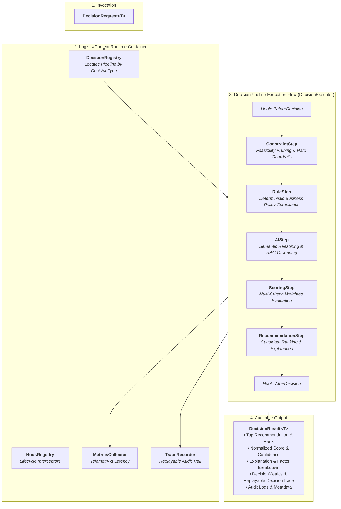

# LogistiX

> **Open Source Framework for AI-Powered Operational Decision Making**
> *Explainable, Multi-Criteria Decision Intelligence for Supply Chains & Beyond*

[](https://opensource.org/licenses/Apache-2.0)
[](https://openjdk.org/projects/jdk/21/)
[](https://spring.io/projects/spring-boot)
[](https://spring.io/projects/spring-ai)
[](https://github.com/pgvector/pgvector)

---

## 🚀 Mission & Vision

**LogistiX** is an extensible open-source framework for building **AI-powered operational decision systems**.

LogistiX is **not** a single-purpose logistics application; it is a reusable framework designed to solve complex operational decision problems where mathematical optimization, business compliance, and AI explainability intersect.

### Supported Decision Domains
While **AI-assisted Driver Dispatch** serves as the initial reference capability, the framework is architected to power:
- 🚚 **Driver Dispatch & Load Assignment**: Proximity, Hours of Service (HOS), and equipment matching.
- 🏢 **Carrier Recommendation**: Rate vs. reliability trade-off evaluation for 3PL freight brokers.
- 🗺️ **Dynamic Route Optimization**: Multi-stop routing under real-time traffic and time windows.
- ⏱️ **Predictive ETA Estimation**: Ingesting live telematics, weather, and congestion models.
- 💰 **Dynamic Freight Pricing**: Spot market rate quotation based on lane elasticity.
- 🏭 **Dock & Yard Scheduling**: Constrained bay door scheduling for warehouse management.
- 🛡️ **Fraud & Anomaly Detection**: Identifying GPS spoofing, phantom loads, and driver deviations.
- 🤖 **Multi-Agent Coordination**: Autonomous negotiation between shipper, broker, and carrier agents.

---

## 🏛️ Framework Execution Engine Architecture

At the center of LogistiX is the **Execution Engine (`logistix-engine`)**, a domain-agnostic runtime inspired by Spring, LangGraph, and Temporal:

1. **`LogistiXContext` (The Global Container)**:
   - Analogous to Spring's `ApplicationContext`.
   - Coordinates `DecisionRegistry`, `PluginRegistry`, `HookRegistry`, `MetricsCollector`, `DomainEventPublisher`, and `DecisionExecutor`.
2. **`DecisionPipeline` & Fluent Builder**:
   - Immutable pipeline created via `DecisionPipeline.builder().step(...).build()`.
   - Supports arbitrary sequence of `DecisionStep` stages without hardcoded domain logic.
3. **`DecisionStep` Contract**:
   - Pure transformation: $( \text{DecisionContext} \to \text{StepResult} )$.
   - Core step specializations: `ConstraintStep`, `RuleStep`, `AIStep`, `ScoringStep`, `RecommendationStep`.
4. **`DecisionPlugin` & Lifecycle Hooks**:
   - Dynamic plugin SPI contributing custom steps and interceptors (`BeforeDecision`, `AfterDecision`, `BeforeStep`, `AfterStep`, `DecisionCompleted`, `DecisionFailed`).
5. **Replayable `DecisionTrace` & Quantitative `DecisionMetrics`**:
   - Captures detailed step-by-step state transitions for visual replay and regulatory audits.

---

## 📐 Engine Execution Flow



---

## 📂 Repository Structure

```
LogistiX/
├── backend/
│   ├── pom.xml                        # Master Parent POM (Java 21, Dependency Management)
│   ├── logistix-common/               # Shared Value Objects, Exceptions, Utilities (Pure Java 21)
│   ├── logistix-domain/               # Pure Domain Layer: DecisionContext, Facts, Rules, Ports
│   ├── logistix-engine/               # Framework Execution Runtime: Pipelines, Steps, Traces, Plugins
│   ├── logistix-decision-engine/      # Composite Pipeline Orchestrators & Strategy Registry
│   ├── logistix-ai/                   # AI Provider Abstractions, Prompts, Tool Calling via Spring AI
│   ├── logistix-rag/                  # Knowledge Ingestion, Retrievers & pgvector Integration
│   ├── logistix-simulation/           # Synthetic Fleet, Demand, Weather & Traffic Simulators
│   ├── logistix-benchmark/            # Model, Rule Engine, and Decision Pipeline Evaluators
│   ├── logistix-starter/              # Spring Boot AutoConfiguration & Properties Binding
│   └── logistix-api/                  # REST Gateway, OpenAPI 3, and Global Exception Handling
├── frontend/                          # Dispatcher UI & Map Visualizers (Reserved)
├── datasets/                          # Benchmark Logistics Datasets & Telemetry Schemas
├── training/                          # Fine-tuning recipes & offline ML pipelines
├── docs/                              # Project Documentation & Architecture Guides
├── architecture/                      # Architectural specs, C4 diagrams, and ADRs
│   └── ADRs/                          # Architecture Decision Records
├── docker/
│   ├── docker-compose.yml             # PostgreSQL 17 + pgvector service
│   └── postgres/
│       └── 01-init-pgvector.sql       # Vector extension initialization script
├── examples/                          # API Request samples & scenario configurations
└── .github/
    └── workflows/
        └── ci.yml                     # GitHub Actions CI Workflow
```

---

## 📦 Module Responsibilities

| Module | Responsibility | Framework Coupling |
| :--- | :--- | :--- |
| **`logistix-common`** | Base value objects (`Coordinates`, `Money`, `EntityId`), standard exceptions, assertions. | Pure Java 21 |
| **`logistix-domain`** | **Framework Domain Core**: `DecisionContext`, `DecisionResult`, `Recommendation`, `FactBag`, `Explanation`, `DecisionAudit`, Domain Events, Outbound SPIs. | Pure Java 21 |
| **`logistix-engine`** | **Framework Runtime**: `DecisionPipeline`, `DecisionStep`, `DecisionExecutor`, `DecisionTrace`, `DecisionMetrics`, `DecisionPlugin`, `LogistiXContext`. | Pure Java 21 |
| **`logistix-decision-engine`** | Pipeline execution coordination, composite rule evaluators, and strategy registries. | `logistix-domain` |
| **`logistix-ai`** | Foundation model provider contracts, prompt abstractions, and tool calling via Spring AI. | Spring AI Core |
| **`logistix-rag`** | Knowledge ingestion, vector embeddings, similarity search, and pgvector store driver. | Spring AI, pgvector |
| **`logistix-simulation`** | Architecture contracts for synthetic fleet, shipment, weather, traffic, and scenario generation. | `logistix-domain` |
| **`logistix-benchmark`** | Architecture contracts for evaluating base models, fine-tuned models, rule engines, decision engines, and RAG. | `logistix-domain` |
| **`logistix-starter`** | Spring Boot AutoConfiguration (`@AutoConfiguration`), properties binding, and IoC wiring. | Spring Boot Starter |
| **`logistix-api`** | REST gateway, OpenAPI 3 documentation, Actuator metrics, and RFC 7807 problem details handler. | Spring Web / Springdoc |

---

## 🛠️ Build & Quickstart

### Prerequisites
- **JDK 21** or higher
- **Maven 3.8+**
- **Docker & Docker Compose**

### 1. Start Infrastructure (PostgreSQL 17 + pgvector)

```bash
cd docker
docker compose up -d
```

### 2. Build Multi-Module Project

```bash
cd backend
mvn clean install
```

### 3. Run the API Gateway

```bash
cd backend/logistix-api
mvn spring-boot:run
```

- **Interactive Swagger UI**: [http://localhost:8080/swagger-ui.html](http://localhost:8080/swagger-ui.html)
- **OpenAPI Schema Definition**: [http://localhost:8080/api-docs](http://localhost:8080/api-docs)
- **Actuator Health & Metrics**: [http://localhost:8080/actuator](http://localhost:8080/actuator)

---

## 📄 License

LogistiX is open-source software licensed under the [Apache License, Version 2.0](LICENSE).
