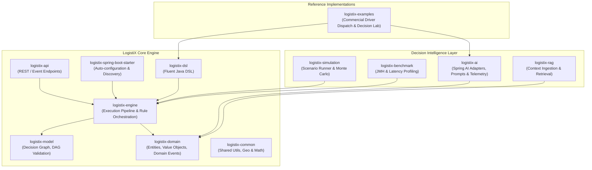
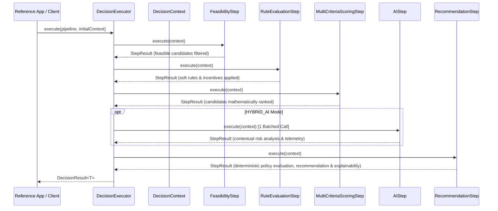
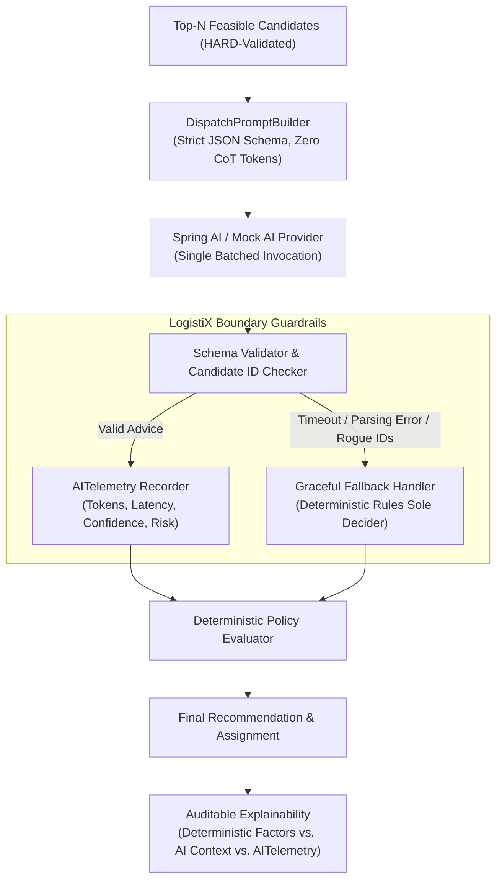
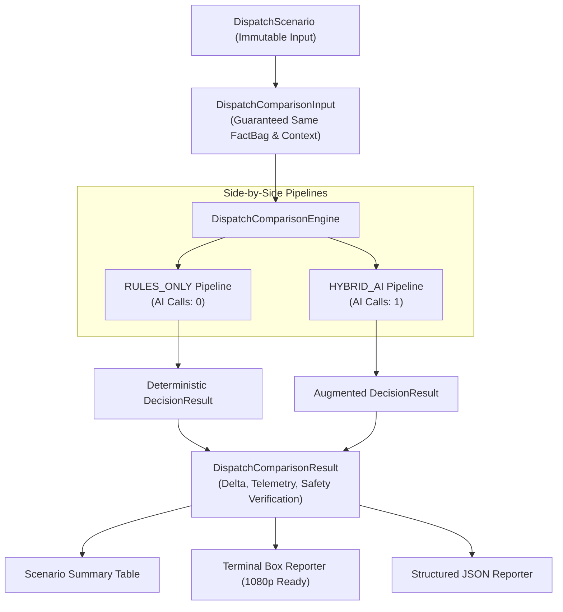

# LogistiX Architecture

## 1. System Architecture Diagram

---

## 2. Module Responsibilities

| Module | Responsibility | Key Technologies |
| :--- | :--- | :--- |
| `logistix-common` | Low-level geometry (Haversine distance), math utilities, common enumerations, and validation primitives. | Java 21 |
| `logistix-domain` | Core domain entities (DecisionContext, Fact, Rule, Score, Recommendation, Explanation), Domain Events, and SPIs (`RuleProvider`, `ConstraintChecker`, `AIProvider`). Strictly framework-agnostic. | Java 21, Records |
| `logistix-model` | Declarative Decision Graph representations, node definitions, Directed Acyclic Graph (DAG) validation, topological sorting, and cycle detection. | JGraphT, Java 21 |
| `logistix-engine` | Synchronous and asynchronous pipeline execution runtime (`DecisionPipeline`, `PipelineStep`, `StepResult`, `DecisionExecutor`). | Virtual Threads (Java 21) |
| `logistix-dsl` | Fluent, type-safe Java Builder DSL for assembling decision graphs, registering steps, rules, and scoring policies. | Java 21 Fluent API |
| `logistix-ai` | Production-grade AI decision boundary, Spring AI adapters, structured prompt builders, batched candidate analysis, and typed `AITelemetry`. | Spring AI, Jackson |
| `logistix-rag` | Retrieval-Augmented Generation context providers and vector integration interfaces. | Java 21 |
| `logistix-simulation` | Scenario generation, batch simulation, deterministic playback, and disruption modeling. | Java 21 |
| `logistix-benchmark` | High-throughput JMH benchmarks and micro-benchmarking harnesses. | JMH |
| `logistix-spring-boot-starter` | Spring Boot 3 auto-configuration, SPI bean discovery, condition evaluators, and lifecycle management. | Spring Boot 3.3.x |
| `logistix-api` | Enterprise REST endpoints, OpenAPI documentation, and problem-detail error handling. | Spring MVC, Springdoc |
| `logistix-examples` | Golden Reference Capabilities (Commercial Driver Dispatch, Decision Lab comparison engine). | Java 21, Spring Boot 3 |

---

## 3. Hexagonal / Clean Architecture Boundaries

LogistiX adheres to Hexagonal Architecture principles:
- **Core Domain Isolation**: `logistix-domain` contains zero dependencies on external frameworks (Spring, Spring AI, JPA).
- **Port/SPI Interfaces**: Ports (`AIProvider`, `RuleProvider`, `ConstraintChecker`) define abstract contracts.
- **Adapters**: Concrete implementations (e.g. `SpringAIDispatchAIProvider`, `MockDispatchAIProvider`) implement ports in peripheral modules (`logistix-ai`, `logistix-examples`).

---

## 4. Pipeline Execution Model

Decision pipelines are defined as ordered, composable steps executed sequentially with deterministic state progression:

---

## 5. Production AI Decision Boundary

LogistiX enforces a strict, production-hardened AI decision boundary:

---

## 6. Golden Reference Capability: Driver Dispatch

The **AI-Assisted Commercial Driver Dispatch Reference Capability** (`logistix-examples`) is the designated **Golden Reference Implementation** for LogistiX. It exemplifies:
- **Clean Architecture Separation**: `logistix-domain` contains 0 dependencies on Spring or Spring AI; AI is bridged strictly via the `AIProvider` SPI.
- **Inviolable Invariant**: *"The deterministic engine establishes what is feasible. AI provides contextual advisory signals. A deterministic policy evaluates those signals. LogistiX retains authority over the final decision."*
- **Regression Standard**: Validated through `DriverDispatchGoldenReferenceTest` and `DriverDispatchDecisionLabTest`.

---

## 7. Driver Dispatch Decision Lab (Sprint 8 & 8.1)

The **Driver Dispatch Decision Lab** (`org.logistix.examples.dispatch.lab`) provides a repeatable comparative framework that benchmarks `RULES_ONLY` vs `HYBRID_AI` on identical operational inputs.

### Core Architectural Insights:
1. **Decision Integrity**: Deterministic feasibility constraints and multi-criteria scoring retain authority.
2. **Context Enrichment**: AI introduces qualitative environmental risk reasoning without manipulating numerical weights.
3. **Deterministic Policy Evaluation**: AI advisory signals are evaluated by a deterministic policy among already HARD-feasible candidates.
4. **Safety Guarantee**: Unsafe or uncertified candidates are filtered deterministically, ensuring that AI recommendations can never compromise operational safety.
5. **Benchmark Semantics**: Explicitly differentiates zero-AI JVM execution, in-memory Mock AI orchestration testing, and live LLM inference with AI overhead accounting.
