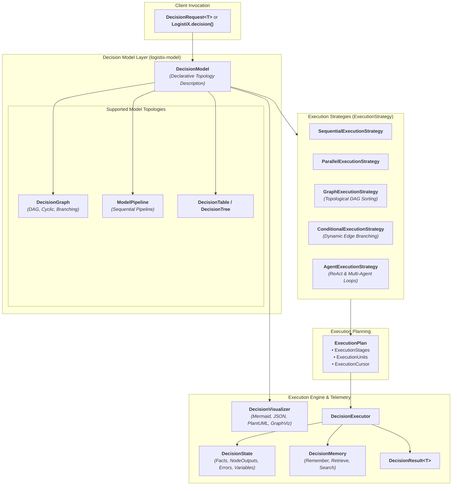
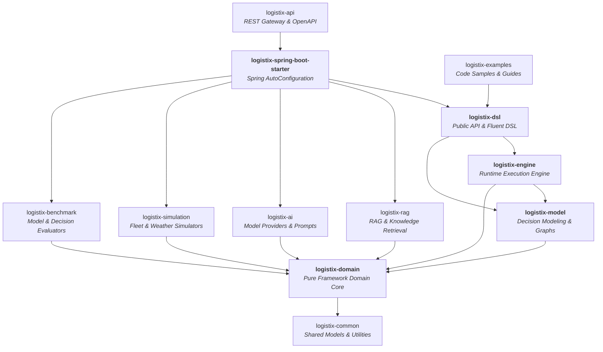

# LogistiX Architecture Specification: Decision Intelligence Platform

## 1. Executive Summary & Philosophy

**LogistiX** is an open-source, domain-agnostic **Decision Intelligence Platform**.

Rather than treating operational decisions as rigid sequential scripts, LogistiX decouples **Decision Modeling** (describing *what* needs to be evaluated) from **Execution Strategy** (determining *how*, when, and in what topology computation happens).

Every decision problem—whether Driver Dispatch, Carrier Recommendation, Multi-Stop Route Optimization, Dynamic Pricing, Dock Scheduling, or Multi-Agent Negotiation—is modeled as a **`DecisionModel`** executed through pluggable execution strategies.

---

## 2. Decision Intelligence Architecture (`logistix-model`)



---

## 3. Pluggable Decision Node Types (`org.logistix.model.node`)

Each node in a `DecisionModel` represents an atomic, isolated unit of work:

| Node Type | Class Contract | Responsibility |
| :--- | :--- | :--- |
| **Constraint** | `ConstraintNode` | Evaluates hard feasibility guardrails and soft boundaries. |
| **Rule** | `RuleNode` | Evaluates deterministic business compliance with priority. |
| **AI / LLM** | `AINode` | Model inference, contextual reasoning, and prompt execution. |
| **Memory** | `MemoryNode` | Short-term working context and long-term historical recall. |
| **Scoring** | `ScoringNode` | Computes normalized multi-criteria objective scores. |
| **Recommendation** | `RecommendationNode` | Synthesizes top-K candidates with explainable rationale. |
| **Validation** | `ValidationNode` | Verifies fact schema completeness and invariant checks. |
| **Transformation** | `TransformationNode` | Data shaping, schema mapping, and derived state computation. |
| **Aggregation** | `AggregationNode` | Merges outputs from multiple concurrent upstream branches. |
| **Condition** | `ConditionNode` | Evaluates dynamic boolean expressions for branch routing. |
| **Delay** | `DelayNode` | Execution throttling, retry backoff, and deliberate delays. |

---

## 4. Decision Graph & Fluent Graph DSL

```java
// Construct a DAG DecisionGraph with zero boilerplate
DecisionGraph graph = LogistiX.graph("carrier-intelligence-graph")
    .name("Carrier Multi-Branch Evaluation")
    .addNode(DecisionGraphNode.of("hos-check", "Check Driver HOS", NodeType.CONSTRAINT))
    .addNode(DecisionGraphNode.of("weather-risk", "Predict Weather Impact", NodeType.AI))
    .addNode(DecisionGraphNode.of("traffic-delay", "Predict Traffic Congestion", NodeType.AI))
    .addNode(DecisionGraphNode.of("score-synthesis", "Aggregate & Score", NodeType.SCORING, List.of("weather-risk", "traffic-delay")))
    .addNode(DecisionGraphNode.of("recommendation", "Final Recommendation", NodeType.RECOMMENDATION, List.of("score-synthesis")))
    .addEdge("hos-check", "weather-risk")
    .addEdge("hos-check", "traffic-delay")
    .addEdge("weather-risk", "score-synthesis")
    .addEdge("traffic-delay", "score-synthesis")
    .addEdge("score-synthesis", "recommendation")
    .build();

// Render to Mermaid
String mermaidDiagram = LogistiX.visualizer().toMermaid(graph);
```

---

## 5. Declarative YAML DSL Schema

Decision topologies can be authored directly in YAML for zero-code deployments:

```yaml
decision:
  name: dynamic-driver-dispatch
  strategy: graph
  version: 1.0.0
  description: Multi-branch AI dispatch under real-time constraints
  nodes:
    - id: hos-guardrail
      type: CONSTRAINT
    - id: weather-inference
      type: AI
      properties:
        model: gpt-4o
        temperature: 0.2
    - id: congestion-model
      type: AI
      properties:
        model: gpt-4o
    - id: multi-criteria-scorer
      type: SCORING
      dependencies: [weather-inference, congestion-model]
    - id: dispatch-recommendation
      type: RECOMMENDATION
      dependencies: [multi-criteria-scorer]
  edges:
    - source: hos-guardrail
      target: weather-inference
    - source: hos-guardrail
      target: congestion-model
    - source: weather-inference
      target: multi-criteria-scorer
    - source: congestion-model
      target: multi-criteria-scorer
    - source: multi-criteria-scorer
      target: dispatch-recommendation
```

---

## 6. Execution Strategies (`org.logistix.model.strategy`)

1. **`SequentialExecutionStrategy`**: Compiles linear pipelines executing in strict serial order.
2. **`ParallelExecutionStrategy`**: Automatically identifies independent nodes and stages them for concurrent execution.
3. **`GraphExecutionStrategy`**: Evaluates directed acyclic graphs (DAGs) using topological sorting.
4. **`ConditionalExecutionStrategy`**: Dynamically evaluates edge predicate conditions at runtime based on the `DecisionState`.
5. **`AgentExecutionStrategy`**: Manages autonomous ReAct / multi-agent reasoning and reflection loops.

---

## 7. Multi-Module Hierarchy


