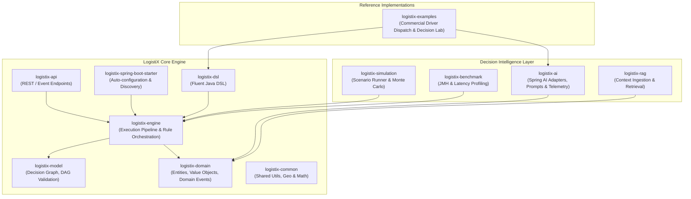
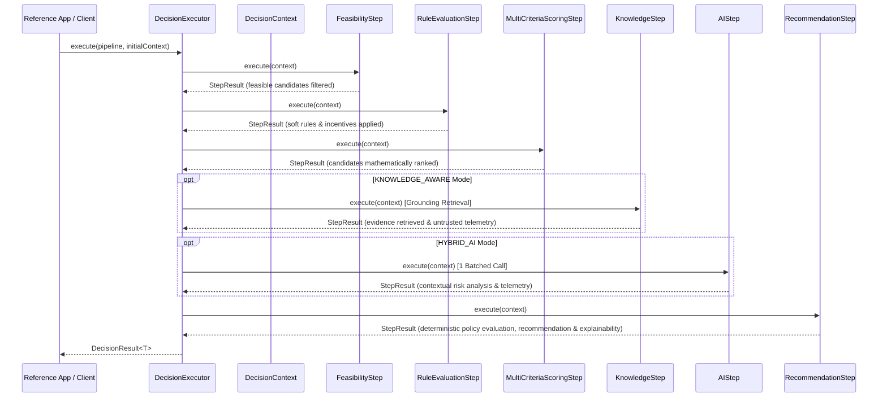
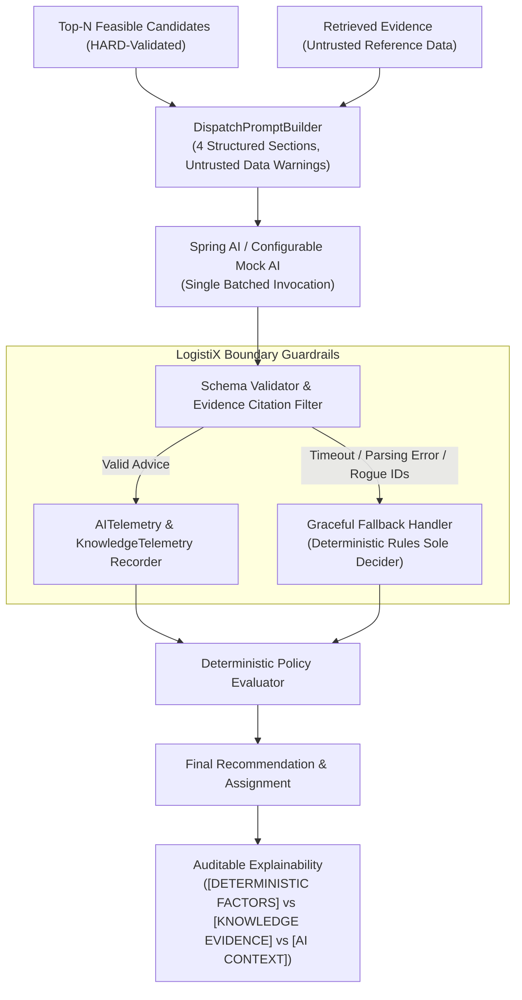
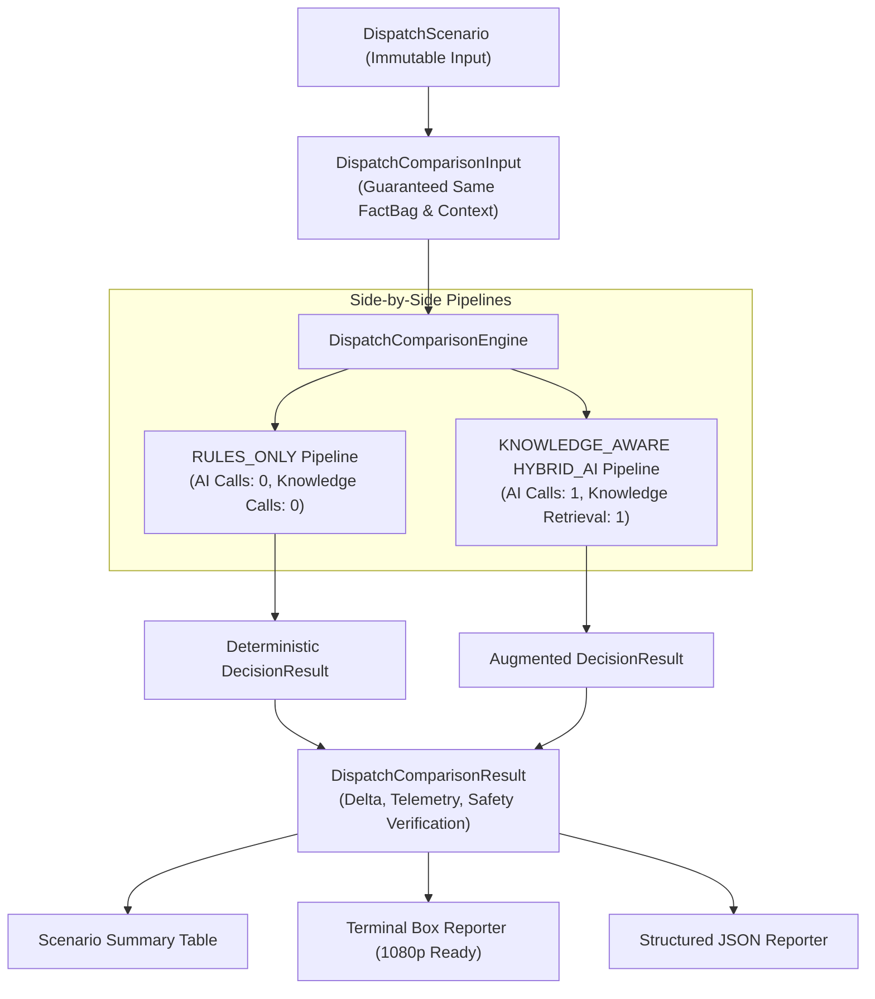

# LogistiX Architecture

## 1. System Architecture Diagram



---

## 2. Module Responsibilities

| Module | Responsibility | Key Technologies |
| :--- | :--- | :--- |
| `logistix-common` | Low-level geometry (Haversine distance), math utilities, common enumerations, and validation primitives. | Java 21 |
| `logistix-domain` | Core domain entities (DecisionContext, Fact, Rule, Score, Recommendation, Explanation), Domain Events, and SPIs (`RuleProvider`, `ConstraintChecker`, `AIProvider`, `KnowledgeProvider`). Strictly framework-agnostic. | Java 21, Records |
| `logistix-model` | Declarative Decision Graph representations, node definitions, Directed Acyclic Graph (DAG) validation, topological sorting, and cycle detection. | JGraphT, Java 21 |
| `logistix-engine` | Synchronous and asynchronous pipeline execution runtime (`DecisionPipeline`, `PipelineStep`, `StepResult`, `DecisionExecutor`). | Virtual Threads (Java 21) |
| `logistix-dsl` | Fluent, type-safe Java Builder DSL for assembling decision graphs, registering steps, rules, and scoring policies. | Java 21 Fluent API |
| `logistix-ai` | Production-grade AI decision boundary, Spring AI adapters, structured prompt builders, batched candidate analysis, deterministic Mock AI test doubles, and typed `AITelemetry`. | Spring AI, Jackson |
| `logistix-rag` | Retrieval-Augmented Generation context providers, in-memory knowledge retrieval, and typed `KnowledgeTelemetry`. | Java 21 |
| `logistix-simulation` | Scenario generation, batch simulation, deterministic playback, and disruption modeling. | Java 21 |
| `logistix-benchmark` | High-throughput JMH benchmarks and micro-benchmarking harnesses. | JMH |
| `logistix-spring-boot-starter` | Spring Boot 3 auto-configuration, SPI bean discovery, condition evaluators, and lifecycle management. | Spring Boot 3.3.x |
| `logistix-api` | Enterprise REST endpoints, OpenAPI documentation, and problem-detail error handling. | Spring MVC, Springdoc |
| `logistix-examples` | Golden Reference Capabilities (Commercial Driver Dispatch, Decision Lab comparison engine, Scenario suite). | Java 21, Spring Boot 3 |

---

## 3. Hexagonal / Clean Architecture Boundaries

LogistiX adheres to Hexagonal Architecture principles:
- **Core Domain Isolation**: `logistix-domain` contains zero dependencies on external frameworks (Spring, Spring AI, JPA, Vector DBs).
- **Port/SPI Interfaces**: Ports (`AIProvider`, `KnowledgeProvider`, `RuleProvider`, `ConstraintChecker`) define abstract contracts.
- **Adapters**: Concrete implementations (`SpringAIDispatchAIProvider`, `MockDispatchAIProvider`, `InMemoryKnowledgeProvider`) implement ports in peripheral modules (`logistix-ai`, `logistix-rag`, `logistix-examples`).

---

## 4. Pipeline Execution Model

Decision pipelines are defined as ordered, composable steps executed sequentially with deterministic state progression:



---

## 5. Production AI & Knowledge Decision Boundary

LogistiX enforces a strict, production-hardened AI decision boundary:



---

## 6. Golden Reference Capability: Driver Dispatch

The **AI-Assisted Commercial Driver Dispatch Reference Capability** (`logistix-examples`) is the designated **Golden Reference Implementation** for LogistiX. It exemplifies:
- **Clean Architecture Separation**: `logistix-domain` contains 0 dependencies on Spring or Spring AI; AI is bridged strictly via the `AIProvider` SPI.
- **Inviolable Invariant**: *"The deterministic engine establishes what is feasible. Knowledge provides evidence. AI interprets evidence. A deterministic policy evaluates those signals. LogistiX retains authority over the final decision."*
- **Regression Standard**: Validated through `DriverDispatchGoldenReferenceTest`, `DriverDispatchDecisionLabTest`, and `KnowledgeGroundingBoundaryTest`.

---

## 7. Driver Dispatch Decision Lab (Sprint 8 & 8.1)

The **Driver Dispatch Decision Lab** (`org.logistix.examples.dispatch.lab`) provides a repeatable comparative framework that benchmarks `RULES_ONLY` vs `HYBRID_AI` on identical operational inputs.



---

## 8. Knowledge Grounding & Test Double Architecture (Sprint 9, 9.1, 9.1.1)

1. **Deterministic Test Double (`MockDispatchAIProvider`)**:
   - Acts strictly as a configurable test double without implementing weather heuristics, driver rating analysis, or knowledge document parsing.
   - Test setups and scenarios explicitly configure candidate advisories. Unconfigured queries return safe, neutral advisories.
2. **Untrusted Reference Data Boundary**:
   - Retrieved enterprise documents are treated as untrusted reference data. System instructions explicitly prohibit executing embedded instructions or modifying hard constraints.
3. **Evidence Citation Validation**:
   - AI may only cite evidence provided in the request. Hallucinated, unknown, or duplicate IDs are stripped and normalized.
4. **Independent Telemetry & Explainability**:
   - `KnowledgeTelemetry` is segregated from `AITelemetry`.
   - Explainability distinctly separates `[DETERMINISTIC FACTORS]`, `[KNOWLEDGE EVIDENCE]`, and `[AI CONTEXTUAL INSIGHTS]`.

---

## 9. Governed AI Actions & MCP Execution Boundary (Sprint 10)

LogistiX enforces a strict, technology-neutral governed action architecture where external intelligence models can only propose actions, never execute them directly.

```
+------------------+       +-------------------------------+       +--------------------+       +----------------------+
|  AI / Decision   | ----> |      LogistiX Governance      | ----> |  AuthorizedAction  | ----> |   ActionExecutor     |
|     Proposal     |       | (Policies, Constraints, Risk) |       |  (Tokenized Grant) |       | (e.g. McpActionExec) |
+------------------+       +-------------------------------+       +--------------------+       +----------------------+
                                      |            |                                                        |
                            [REJECTED]|            |[APPROVAL_REQUIRED]                                     v
                                      v            v                                              +--------------------+
                                 +--------------------+                                           |   Enterprise Tool  |
                                 |  Audit Log Record  |                                           | (TMS / Fleet / DB) |
                                 |   (0 MCP Calls)    |                                           +--------------------+
                                 +--------------------+
```

### Architectural Principles:
1. **AI Proposes, LogistiX Decides**: AI proposals (`ActionProposal`) have zero direct authority and cannot be accepted by execution adapters.
2. **Deterministic Governance (`ActionGovernanceEngine`)**: Evaluates policies, hard constraints, and risk levels deterministically, returning `APPROVED`, `REJECTED`, or `APPROVAL_REQUIRED`.
3. **Authorized Action Invariant (`AuthorizedAction`)**: Only tokenized, validated `AuthorizedAction` instances can be executed by outbound adapters (`ActionExecutor`).
4. **Controlled Tool Registry (`ToolRegistry`)**: Outbound adapters execute only registered, pre-approved enterprise tools (`changeDeliveryAppointment`, `assignDriver`, `updateShipmentStatus`). Arbitrary tool invocations are rejected.
5. **Technology-Neutral Domain**: The core domain (`logistix-domain`) is 100% agnostic and unaware of MCP, HTTP, JSON-RPC, or external tool protocols. The Model Context Protocol exists purely as an infrastructure adapter (`logistix-mcp`).
6. **Segregated Telemetry & Complete Audit**: `ActionTelemetry` captures governance and execution latencies independently from AI/Knowledge telemetry. Every proposal, decision, and execution is recorded immutably in `ActionAuditEntry`.

---

## 10. Single Authority Registry & MCP Boundary Unification (Sprint 10.2.4)

The application context enforces a strict **Single Authority Registry Invariant**:
- There is exactly **one** `AuthorizationAuthorityRegistry` per LogistiX application context, owned and configured exclusively by core security (`logistix-spring-boot-starter`).
- The `logistix-mcp` module is an optional execution adapter that consumes the core `AuthorizationAuthorityRegistry` via `@ConditionalOnBean(AuthorizationAuthorityRegistry.class)` and `@AutoConfigureAfter(LogistiXAutoConfiguration.class)`.
- MCP cannot define or duplicate authorities, nor can it activate independently when security is disabled (`logistix.security.enabled=false`).


