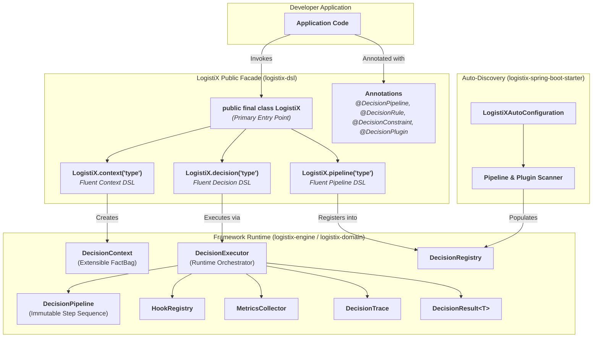
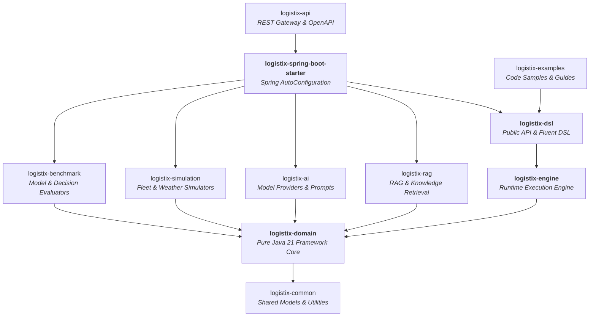

# LogistiX Architecture Specification: Framework & Developer Experience

## 1. Executive Summary & Philosophy

**LogistiX** is an open-source, domain-agnostic framework for **AI-powered operational decision making**. 

Inspired by the elegance of **Spring Boot**, the pipeline flexibility of **LangGraph**, the resiliency of **Temporal**, and the declarative fluent DSLs of **Apache Camel**, LogistiX provides a complete decision runtime and Developer Experience (DX) that hides internal complexity behind intuitive public abstractions.

---

## 2. Public API Layer (`logistix-dsl`)



---

## 3. The Fluent Decision DSL

Developers can execute complex operational decisions with zero ceremony:

```java
// 1. One-Liner / Fluent Decision Execution
DecisionResult<Driver> result = LogistiX.<Driver>decision("driver-dispatch")
    .fact("shipment", shipment)
    .fact("candidateDrivers", drivers)
    .constraint(new MaxDistanceConstraint(50.0))
    .rule(new SeniorityPriorityRule())
    .execute();

// 2. Fluent Pipeline Assembly
DecisionPipeline pipeline = LogistiX.pipeline("carrier-recommendation")
    .name("Carrier-Selection-Pipeline")
    .version("1.2.0")
    .step(new CapacityConstraintStep())
    .step(new ServiceLevelAgreementRuleStep())
    .step(new RouteRiskAiStep())
    .step(new WeightedScoringStep())
    .step(new ExplainableRecommendationStep())
    .build();
```

---

## 4. Declarative Annotations (`org.logistix.dsl.annotation`)

LogistiX provides a comprehensive set of annotations for declarative component declaration and auto-discovery:

| Annotation | Target | Purpose |
| :--- | :--- | :--- |
| **`@DecisionPipeline`** | Class / Method | Declares a named pipeline handling a specific decision type. |
| **`@DecisionRule`** | Class / Method | Defines a deterministic business rule with priority ordering. |
| **`@DecisionConstraint`** | Class / Method | Defines a feasibility guardrail (`HARD` or `SOFT`). |
| **`@DecisionPlugin`** | Class | Marks a third-party extension contributing steps and hooks. |
| **`@DecisionProvider`** | Class | Identifies an external SPI provider (AI, Knowledge, Rules). |
| **`@DecisionComponent`** | Class / Method | General marker for LogistiX framework beans. |

---

## 5. Spring Boot Starter & Auto-Discovery (`logistix-spring-boot-starter`)

When added to a Spring Boot application, `logistix-spring-boot-starter`:
1. Activates **`LogistiXAutoConfiguration`**.
2. Scans for `@DecisionPipeline`, `@DecisionRule`, `@DecisionConstraint`, and `@DecisionPlugin` beans.
3. Automatically populates `DecisionRegistry` and `PluginRegistry`.
4. Binds external application properties via `@ConfigurationProperties(prefix = "logistix")`.
5. Exposes the configured container via `LogistiX.getContext()`.

---

## 6. Service Provider Interface (SPI)

Third-party developers can extend any stage of LogistiX without modifying core code:
- **`DecisionPlugin`**: Contributes custom steps, lifecycle hooks, and configuration.
- **`AIProvider`**: Pluggable LLM reasoning backends (Spring AI, OpenAI, Anthropic, Ollama, local fine-tuned models).
- **`KnowledgeProvider`**: Vector search and RAG knowledge retrievers (pgvector, Qdrant, Milvus).
- **`RuleProvider`**: External rule engines (Drools, JSON rules, custom script evaluators).
- **`ConstraintProvider`**: Hard and soft mathematical optimization constraint sets.

---

## 7. Command-Line Interface (CLI) Architecture

The framework defines standard contracts for future CLI toolchains (`org.logistix.dsl.cli`):
- `logistix new decision <name>`: Scaffolds a new decision pipeline with sample constraints, rules, and tests.
- `logistix doctor`: Validates Java 21 runtime, database connections, and registered pipelines.
- `logistix validate`: Statically verifies rule precedence, constraint completeness, and pipeline integrity.
- `logistix benchmark`: Executes high-throughput scenario simulations and latency benchmarks.

---

## 8. Multi-Module Hierarchy


