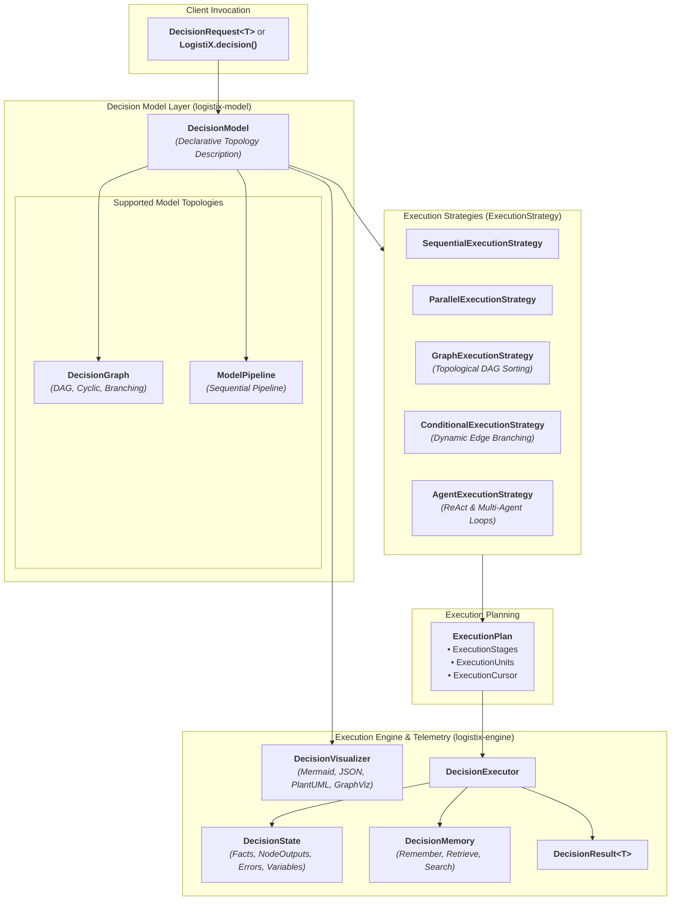
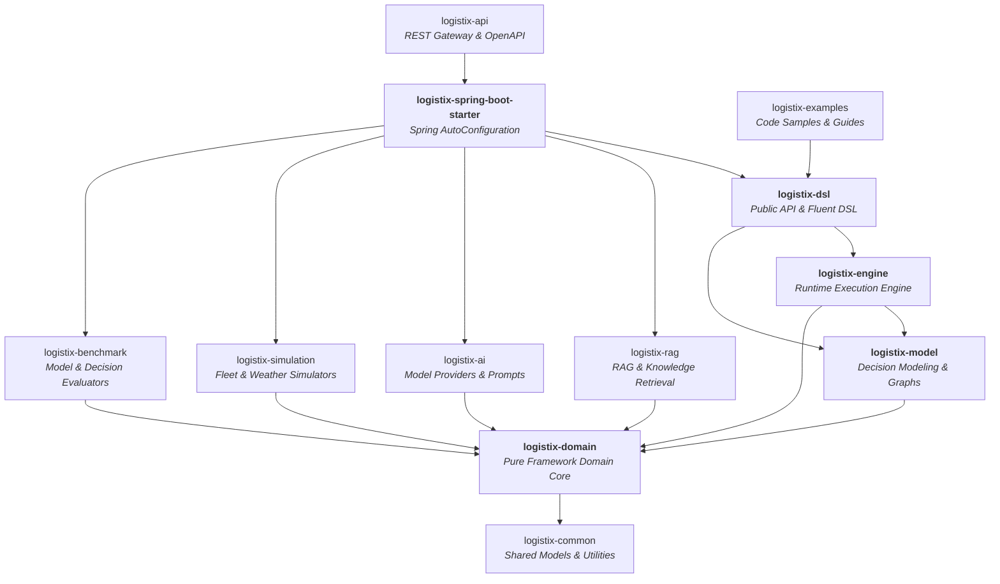

# LogistiX Architecture Specification: Release Candidate 1 (RC1)

## 1. Executive Summary & Philosophy

**LogistiX** is an open-source, domain-agnostic **Decision Intelligence Platform**.

Rather than treating operational decisions as rigid sequential scripts, LogistiX decouples **Decision Modeling** (describing *what* needs to be evaluated) from **Execution Strategy** (determining *how*, when, and in what topology computation happens).

Every decision problem—whether Driver Dispatch, Carrier Recommendation, Multi-Stop Route Optimization, Dynamic Pricing, Dock Scheduling, or Multi-Agent Negotiation—is modeled as a **`DecisionModel`** executed through pluggable execution strategies.

---

## 2. Decision Intelligence Architecture (`logistix-model` & `logistix-engine`)

---

## 3. Pluggable Decision Node Types (`org.logistix.model.node`)

Each node in a `DecisionModel` represents an atomic, isolated unit of work:

| Node Type | Class Contract | Responsibility |
| :--- | :--- | :--- |
| **Constraint** | `ConstraintNode` | Evaluates hard feasibility guardrails and soft boundaries. |
| **Rule** | `RuleNode` | Evaluates deterministic business compliance with priority. |
| **AI / LLM** | `AINode` | Model inference, contextual reasoning, and prompt execution. |
| **Memory** | `MemoryNode` | Short-term working context and long-term historical recall. |
| **Scoring** | `ScoringNode` | Computes normalized multi-criteria objective scores. |
| **Recommendation** | `RecommendationNode` | Synthesizes top-K candidates with explainable rationale. |
| **Validation** | `ValidationNode` | Verifies fact schema completeness and invariant checks. |
| **Transformation** | `TransformationNode` | Data shaping, schema mapping, and derived state computation. |
| **Aggregation** | `AggregationNode` | Merges outputs from multiple concurrent upstream branches. |
| **Condition** | `ConditionNode` | Evaluates dynamic boolean expressions for branch routing. |
| **Delay** | `DelayNode` | Execution throttling, retry backoff, and deliberate delays. |

---

## 4. Consolidated Multi-Module Hierarchy

---

## 5. API Stability Matrix (RC1)

| Contract Group | Package | Stability |
| :--- | :--- | :--- |
| **Public Entry Point** | `org.logistix.dsl.LogistiX` | **Stable** |
| **Fluent DSLs** | `org.logistix.dsl.fluent.*` | **Stable** |
| **Annotations** | `org.logistix.dsl.annotation.*` | **Stable** |
| **Core Domain Models** | `org.logistix.domain.decision.*`, `org.logistix.domain.fact.*` | **Stable** |
| **Decision Models & Graph** | `org.logistix.model.model.*`, `org.logistix.model.graph.*` | **Stable** |
| **Execution Strategies** | `org.logistix.model.strategy.*` | **Stable** |
| **Engine Runtime & SPI** | `org.logistix.engine.executor.*`, `org.logistix.engine.plugins.*` | **Stable** |
| **Spring Boot Integration** | `org.logistix.starter.autoconfig.*`, `org.logistix.starter.scanner.*` | **Stable** |
