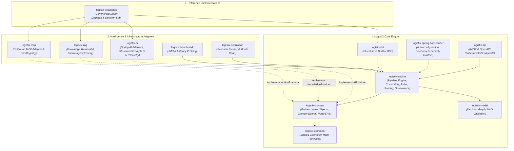
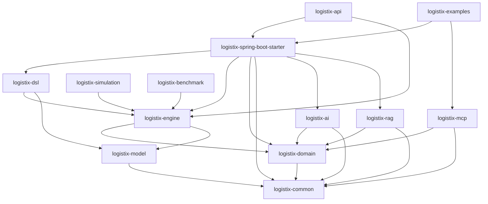
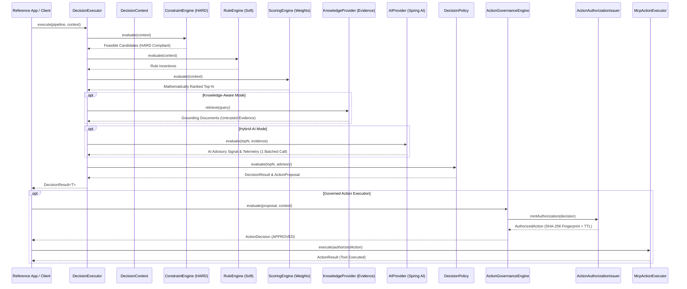

# LogistiX Architecture Reference

## 1. System Architecture Overview

LogistiX is structured around Hexagonal Architecture (Ports & Adapters) and Clean Architecture principles, ensuring that core business and decision policies remain 100% isolated from infrastructure and external technologies:



---

## 2. Maven Module Dependency Graph



---

## 3. Module Responsibilities & Technologies

| Module | Responsibility | Key Technologies | Framework Isolation |
| :--- | :--- | :--- | :--- |
| `logistix-common` | Low-level geometry (Haversine distance), math utilities, common enumerations, and validation primitives. | Java 21 | Zero dependencies |
| `logistix-domain` | Pure domain entities (`DecisionContext`, `Fact`, `Rule`, `Score`, `Recommendation`, `Explanation`), Domain Events, outbound ports (`AIProvider`, `KnowledgeProvider`, `ActionExecutor`), and `AuthorizationAuthorityRegistry`. | Java 21, Records | **Zero** external framework dependencies |
| `logistix-model` | Declarative Decision Graph representations, node definitions, Directed Acyclic Graph (DAG) validation, topological sorting, and cycle detection. | JGraphT, Java 21 | Pure model representation |
| `logistix-engine` | Synchronous and asynchronous execution runtime (`DecisionPipeline`, `PipelineStep`, `ConstraintEngine`, `RuleEngine`, `ScoringEngine`, `DefaultActionGovernanceEngine`). | Virtual Threads (Java 21) | Zero web/framework coupling |
| `logistix-dsl` | Fluent, type-safe Java Builder DSL (`LogistiX.decision()`) for assembling decision graphs, registering steps, rules, and scoring policies. | Java 21 Fluent API | Built on engine & domain |
| `logistix-ai` | Production-grade AI decision boundary, Spring AI adapters, structured prompt builders, batched candidate analysis, deterministic `MockDispatchAIProvider`, and typed `AITelemetry`. | Spring AI Core, Jackson | Isolated behind `AIProvider` SPI |
| `logistix-rag` | Retrieval-Augmented Generation context providers, `InMemoryKnowledgeProvider`, and typed `KnowledgeTelemetry`. | Java 21, pgvector (optional) | Isolated behind `KnowledgeProvider` SPI |
| `logistix-mcp` | Outbound Model Context Protocol adapter, `McpActionExecutor`, `ToolRegistry`, and JSON-RPC dispatch. | Spring Boot Autoconfigure, Jackson | Isolated behind `ActionExecutor` SPI |
| `logistix-spring-boot-starter` | Spring Boot 3 auto-configuration, SPI bean discovery, security property binding, and single `AuthorizationAuthorityRegistry` management. | Spring Boot 3.4.x | Configures core runtime context |
| `logistix-api` | Enterprise REST endpoints, OpenAPI documentation, and RFC 7807 ProblemDetail error handling. | Spring MVC, Springdoc | HTTP ingress adapter |
| `logistix-simulation` | Scenario generation, batch simulation, deterministic playback, and disruption modeling. | Java 21 | Simulation adapter |
| `logistix-benchmark` | High-throughput JMH benchmarks and micro-benchmarking harnesses. | JMH | Benchmarking suite |
| `logistix-examples` | Commercial Driver Dispatch Golden Reference Capability, Decision Lab comparison engine, and CLI runner. | Java 21, Spring Boot 3 | Reference application |

---

## 4. Decision Pipeline & Action Execution Model



---

## 5. Intelligence & Governance Boundaries

LogistiX maintains strict, non-negotiable boundaries separating advisory intelligence from deterministic governance:

```
    ┌─────────────────────────────────────────────┐
    │              APPLICATION / DSL              │
    └──────────────────────┬──────────────────────┘
                           │
                           ▼
    ┌─────────────────────────────────────────────┐
    │          DECISION INTELLIGENCE              │
    │                                             │
    │ Context • Constraints • Rules • Scoring     │
    │ Recommendation • Explainability             │
    └───────────────┬─────────────────────────────┘
                    │
          ┌─────────┴─────────┐
          ▼                   ▼
    Knowledge/RAG         Spring AI
          │                   │
          ▼                   ▼
       Evidence          AI Advisory
          │                   │
          └─────────┬─────────┘
                    ▼
           Deterministic Policy
                    │
                    ▼
             Action Proposal
                    │
                    ▼
               Governance
                    │
        ┌───────────┼───────────┐
        ▼           ▼           ▼
      REJECT      APPROVAL    APPROVE
                                │
                                ▼
                         AuthorizedAction
                                │
                                ▼
                         ActionExecutor
                                │
                                ▼
                           MCP Adapter
                                │
                                ▼
                          Tool Registry
                                │
                                ▼
                       Enterprise Systems
```

### Inviolable Architectural Principles:
1. **Knowledge $\neq$ Decision Authority**: Knowledge documents provide reference context and evidence, never direct policy enforcement.
2. **AI $\neq$ Authorization Authority**: AI proposals (`ActionProposal`) have zero direct authority and cannot be accepted by execution adapters.
3. **MCP $\neq$ Governance**: MCP is strictly an outbound execution connectivity adapter; it cannot formulate decisions or create authority.
4. **Deterministic Governance (`ActionGovernanceEngine`)**: Evaluates policies, hard constraints, and risk levels deterministically, returning `APPROVED`, `REJECTED`, or `APPROVAL_REQUIRED`.
5. **Authorized Action Invariant (`AuthorizedAction`)**: Only immutable, validated `AuthorizedAction` artifacts minted by trusted `ActionAuthorizationIssuer` can be executed by outbound adapters (`ActionExecutor`).
6. **Controlled Tool Registry (`ToolRegistry`)**: Outbound adapters execute only registered, pre-approved enterprise tools (`changeDeliveryAppointment`, `assignDriver`, `updateShipmentStatus`). Arbitrary tool invocations are rejected.
7. **Single Authority Registry Invariant**: There is exactly **one** `AuthorizationAuthorityRegistry` per application context, owned and configured exclusively by core security (`logistix-spring-boot-starter`). MCP consumes this registry and cannot own or duplicate authorities.
8. **Segregated Telemetry & Complete Audit**: `ActionTelemetry` captures governance and execution latencies independently from AI/Knowledge telemetry. Every proposal, decision, and execution is recorded immutably in `ActionAuditEntry`.
