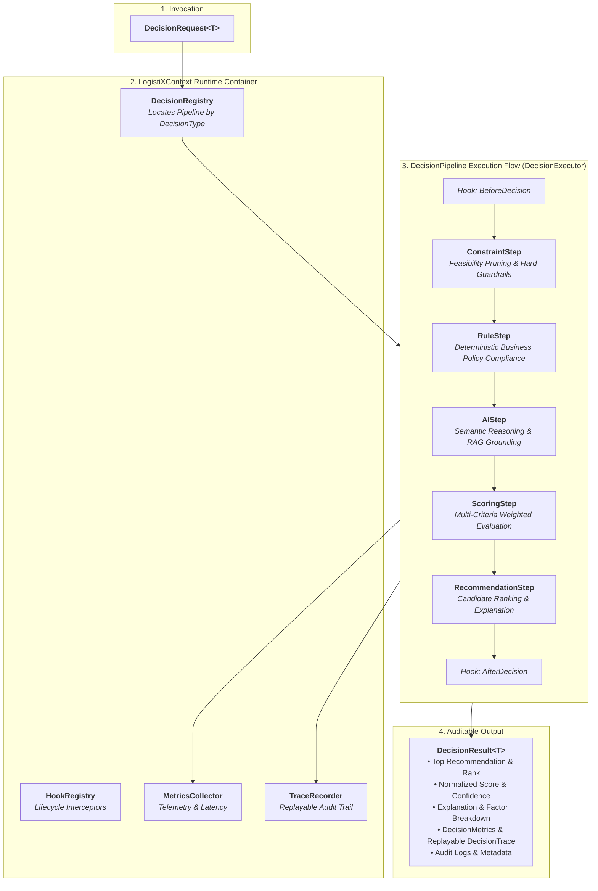
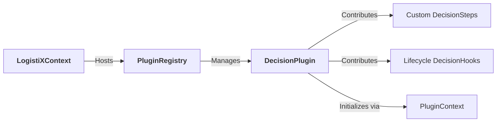
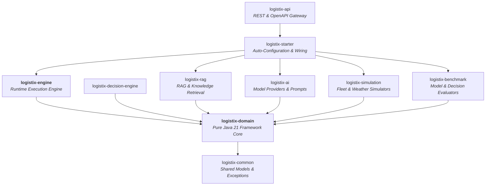

# LogistiX Architecture Specification: Framework Execution Engine Runtime

## 1. Executive Summary & Philosophy

**LogistiX** is an open-source, domain-agnostic framework for **AI-powered operational decision making**. 

Rather than being a static logistics application, LogistiX provides a resilient, extensible execution runtime inspired by leading framework architectures (Spring Framework, LangGraph, Temporal, Apache Camel).

Every operational decision in LogistiX—from driver dispatch to dynamic pricing, carrier recommendation, route optimization, dock scheduling, and fraud detection—executes via the **LogistiX Execution Engine (`logistix-engine`)**.

---

## 2. Core Framework Runtime Components

### A. `LogistiXContext` (The Global Container)
The runtime container analogous to Spring's `ApplicationContext`. It centralizes:
- **`DecisionRegistry`**: Dynamic registration and lookup of decision pipelines.
- **`PluginRegistry`**: Discovery and lifecycle management for third-party extensions.
- **`HookRegistry`**: Interceptor lifecycle hooks.
- **`MetricsCollector`**: Aggregates timing, rule evaluations, constraint violations, and AI token telemetry.
- **`DomainEventPublisher`**: Broadcasts lifecycle events asynchronously.
- **`DecisionExecutor`**: The main pipeline execution engine.

### B. `DecisionPipeline` & `DecisionStep`
- **`DecisionPipeline`**: Immutable sequential execution abstraction created via `DecisionPipelineBuilder`.
- **`DecisionStep`**: Pure transformation contract $( \text{DecisionContext} \to \text{StepResult} )$. Pipelines are agnostic to domain semantics.
- Specialized step contracts: `ConstraintStep`, `RuleStep`, `AIStep`, `ScoringStep`, `RecommendationStep`.

### C. `DecisionExecutor`
The core runtime coordinator:
1. Resolves pipelines via `DecisionRegistry`.
2. Triggers `BeforeDecision` / `BeforeStep` / `AfterStep` / `AfterDecision` lifecycle hooks.
3. Records `StepMetrics` and builds replayable `DecisionTrace` entries.
4. Handles short-circuiting or failure recovery according to `EngineConfiguration`.
5. Emits `DecisionCompletedEvent` and returns the final `DecisionResult`.

---

## 3. Decision Engine Runtime Flow

---

## 4. Plugin Architecture (`org.logistix.engine.plugins`)

LogistiX features a non-invasive plugin model allowing third-party extensions to dynamically contribute:
- Custom **`DecisionStep`** implementations.
- Custom **`DecisionHook`** lifecycle interceptors.
- External rules, constraints, and scoring providers.

---

## 5. Decision Trace & Metrics Telemetry

### Replayable Trace (`DecisionTrace`)
Each executed step appends a `DecisionTraceEntry` capturing:
- Step identifier and human-readable name.
- Input and output state diffs.
- Emitted fact keys.
- Step execution status (`SUCCESS`, `SKIPPED`, `FAILED`, `SHORT_CIRCUIT`).
- Execution duration and messages.

This enables UI visualizers and simulation tools to **replay the entire decision lifecycle step-by-step**.

### Quantitative Metrics (`DecisionMetrics`)
- Total execution duration.
- Per-step duration breakdown.
- Evaluated vs. passed rule counts.
- Violated constraint counts.
- AI tokens consumed and AI model inference latency.
- Warning and error tallies.

---

## 6. Multi-Module Layout

