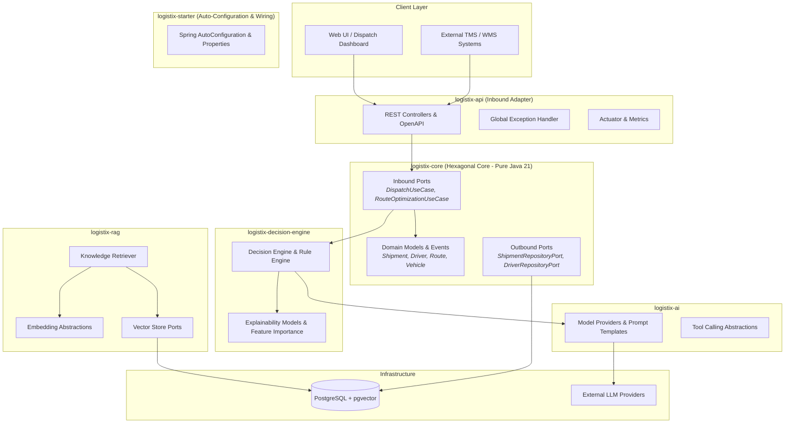

# LogistiX Architecture Specification

## Overview & Mission
**LogistiX** is an open-source AI platform for logistics and transportation with explainable decision intelligence. It is designed to bridge domain operations (dispatching, routing, freight pricing, ETA prediction) with modern AI capabilities (LLM tool-calling, RAG, multi-agent coordination, and custom fine-tuned models).

---

## Architectural Principles

1. **Hexagonal / Clean Architecture (Ports & Adapters)**:
   - The domain core (`logistix-core`, `logistix-common`, `logistix-decision-engine`) is completely isolated from frameworks, databases, and network transports.
   - External dependencies (REST, PostgreSQL, pgvector, LLM APIs) interact strictly via Inbound and Outbound Ports (SPIs).
2. **Explainability by Design**:
   - Every AI recommendation or algorithmic decision produces a structured `DecisionExplanation` capturing feature importances, trade-offs, confidence scores, and rule outcomes.
3. **Constructor Injection Only**:
   - All components and Spring beans rely strictly on constructor injection for immutability, testability, and explicit dependency graphs.
4. **No Circular Dependencies**:
   - Strict hierarchical acyclic module dependency graph (DAG) enforced at build time.

---

## High-Level System Architecture

---

## Module Boundaries

| Module | Framework Coupling | Description |
| :--- | :--- | :--- |
| `logistix-common` | **None** (Pure Java 21) | Base value objects, exceptions, pagination, standard utilities |
| `logistix-core` | **None** (Pure Java 21) | Core domain entities, immutable records, domain events, inbound/outbound ports |
| `logistix-decision-engine` | **None** (Pure Java 21) | Decision contracts, rule engines, explainability records, recommendation scorers |
| `logistix-ai` | Spring AI Core | Model provider interfaces, prompt abstractions, function/tool calling contracts |
| `logistix-rag` | Spring AI, pgvector | Knowledge document chunking, embeddings, similarity query models, vector store SPI |
| `logistix-starter` | Spring Boot Starter | Autoconfiguration, `@ConfigurationProperties` binding, IoC assembly |
| `logistix-api` | Spring Web, Springdoc | REST API endpoints, OpenAPI documentation, Actuator telemetry, RFC 7807 handler |
