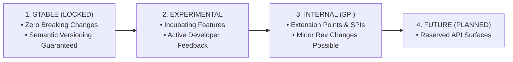

# LogistiX Framework API Stability Matrix (Release Candidate 2)

This document defines the formal stability guarantees, lifecycle tiers, backward compatibility rules, and deprecation policies governing the LogistiX Decision Intelligence Framework.

---

## 1. Stability Classification Tiers

Every public API in LogistiX belongs to one of four lifecycle classifications:

---

## 2. API Stability Matrix

### A. Stable APIs (Guaranteed Zero Breaking Changes in 0.x / 1.x)

These APIs represent the bedrock of the LogistiX Framework. Any change to these signatures must undergo formal deprecation across two minor releases:

| Component / Layer | Interface / Class / Record | Package | Stability Guarantee |
| :--- | :--- | :--- | :--- |
| **Public Entry Point** | `LogistiX` | `org.logistix.dsl` | Static factory methods (`decision()`, `pipeline()`, `graph()`, `context()`, `visualizer()`, `configure()`) are locked. |
| **Fluent Decision DSL** | `FluentDecision<T>` | `org.logistix.dsl.fluent` | Method chaining contracts (`fact()`, `facts()`, `context()`, `execute()`) are locked. |
| **Fluent Pipeline DSL** | `FluentPipeline` | `org.logistix.dsl.fluent` | Step registration contracts are locked. |
| **Fluent Context DSL** | `FluentContext` | `org.logistix.dsl.fluent` | Decision context assembly methods are locked. |
| **Core Annotations** | `@DecisionPipeline`, `@DecisionRule`, `@DecisionConstraint`, `@DecisionPlugin`, `@DecisionProvider`, `@DecisionComponent` | `org.logistix.dsl.annotation` | Annotation attributes and semantics are locked. |
| **Domain Model** | `DecisionContext`, `FactBag`, `Fact`, `DecisionResult<T>`, `Recommendation<T>`, `Score`, `Explanation`, `FeatureContribution` | `org.logistix.domain.*` | Immutable records and core query signatures are locked. |
| **Decision Modeling** | `DecisionModel`, `DecisionGraph`, `DecisionGraphNode`, `DecisionEdge`, `DecisionState`, `DecisionVariables`, `DecisionVariable<T>` | `org.logistix.model.*` | Declarative graph and state representations are locked. |
| **Execution Strategies** | `ExecutionStrategy`, `SequentialExecutionStrategy`, `ParallelExecutionStrategy`, `GraphExecutionStrategy`, `ConditionalExecutionStrategy`, `AgentExecutionStrategy` | `org.logistix.model.strategy` | Strategy execution planning contracts are locked. |
| **Runtime Execution** | `DecisionExecutor`, `DefaultDecisionExecutor`, `DecisionRegistry`, `DecisionPlugin`, `DecisionHook`, `DecisionTrace` | `org.logistix.engine.*` | Execution pipeline and plugin interceptor lifecycles are locked. |
| **Spring Boot Starter** | `LogistiXAutoConfiguration`, `LogistiXProperties`, `PipelineScanner`, `PluginScanner`, `DecisionAutoRegistrar` | `org.logistix.starter.*` | Automatic classpath scanning and Spring auto-configuration are locked. |

---

### B. Experimental APIs (Subject to Evolution with Notice)

These components are available for production trial but may receive ergonomic improvements based on real-world adoption:

| Component | Target Artifact | Intended Evolution |
| :--- | :--- | :--- |
| `YamlDecisionModelDefinition` | `org.logistix.model.serialization` | Zero-code YAML declarative schema parser. |
| `DecisionVisualizer` | `org.logistix.model.visualizer` | Diagram rendering for Mermaid, PlantUML, and GraphViz. |
| `SimulationEngine` | `org.logistix.simulation.engine` | Synthetic scenario generators and traffic/weather fleet simulators. |
| `BenchmarkScenario` | `org.logistix.simulation.scenario` | Decision latency and multi-criteria evaluation harnesses. |

---

### C. Internal APIs (SPI & Framework Engine Internals)

Classes located in the following packages are intended for framework internals and custom SPI implementers:

- `org.logistix.engine.steps.*`
- `org.logistix.engine.trace.*`
- `org.logistix.model.plan.ExecutionCursor`
- `org.logistix.model.validation.*`

---

## 3. Backward Compatibility & Semantic Versioning Rules

LogistiX adheres strictly to [Semantic Versioning 2.0.0](https://semver.org/):

1. **Patch Releases (`0.1.x`)**:
   - Bug fixes, performance optimizations, and documentation updates.
   - Strictly binary and source compatible.
2. **Minor Releases (`0.x.0` / `1.x.0`)**:
   - New declarative capabilities, nodes, or execution strategies.
   - Backward compatible with existing `@Decision*` components and DSL scripts.
3. **Major Releases (`2.0.0`)**:
   - Reserved for foundational architectural evolutions. Deprecated APIs will be removed only after remaining deprecated for at least two minor releases.

---

## 4. Deprecation Policy

When an API is marked for replacement:
1. It is annotated with `@Deprecated(since = "x.y.z", forRemoval = true)`.
2. Clear JavaDoc `@deprecated` tags are added specifying the exact migration path.
3. The API remains functional for at least **two minor release cycles** before removal.
