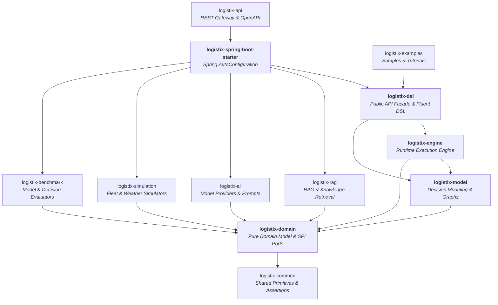
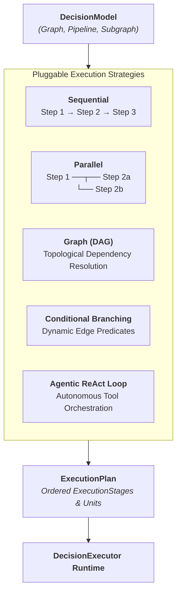

# LogistiX Framework Overview & Technical Architecture

## 1. Architectural Philosophy & Mission

LogistiX is a high-performance, domain-agnostic **Decision Intelligence Framework** engineered in Java 21.

Traditional operational systems either hardcode rigid sequential decision scripts or surrender control entirely to non-deterministic, black-box AI models. LogistiX bridges this divide by providing a unified, multi-strategy framework where:
1. **Deterministic Guardrails** (hard feasibility constraints and compliance rules) safeguard every operation.
2. **AI & ML Inference** provide intelligent ranking, feature extraction, and candidate suggestions.
3. **Pluggable Execution Strategies** decouple declarative decision topologies from underlying execution runtimes.
4. **Audit-Ready Explainability** is a mandatory, first-class citizen of every decision outcome.

---

## 2. Framework Layers & Module Responsibilities



### A. `logistix-common` (Domain Primitives & Assertions)
- **Role**: Shared immutable value objects and domain-level assertion utilities.
- **Key Artifacts**: `Coordinates`, `Money`, `EntityId`, `PriorityLevel`, `Status`, `DomainAssertions`.
- **Constraint**: Zero external framework dependencies; pure Java 21.

### B. `logistix-domain` (Pure Framework Domain Core)
- **Role**: Core domain abstractions, immutable fact containers, and outbound SPI ports.
- **Key Artifacts**:
  - `DecisionContext`: Immutable context holding execution parameters and metadata.
  - `FactBag` & `Fact`: Typed key-value fact store with provenance tracking.
  - `DecisionResult<T>`: Final decision outcome pairing a `Recommendation<T>`, normalized `Score`, confidence rating, and `Explanation`.
  - Outbound SPI Ports: `AIProvider`, `KnowledgeProvider`, `RuleProvider`, `ConstraintProvider`, `ScoringProvider`.
- **Constraint**: Strict Hexagonal Architecture purity; zero Spring or AI SDK imports.

### C. `logistix-model` (Decision Intelligence & Graph Modeling)
- **Role**: Declarative description of decision structures, nodes, edges, state, and planning strategies.
- **Key Artifacts**:
  - `DecisionModel`: Top-level topology descriptor.
  - `DecisionGraph` & `DecisionGraphBuilder`: Directed graph model supporting DAG, cyclic, and branching workflows.
  - `ModelPipeline`: Linear sequential topology implementation of `DecisionModel`.
  - `DecisionNode` Taxonomy: `ConstraintNode`, `RuleNode`, `AINode`, `MemoryNode`, `ScoringNode`, `RecommendationNode`, `ValidationNode`, `TransformationNode`, `AggregationNode`, `ConditionNode`, `DelayNode`.
  - `DecisionEdge` & `EdgeType`: Directed dependency, sequencing, parallel, and conditional edges.
  - `ExecutionStrategy` Contracts: `SequentialExecutionStrategy`, `ParallelExecutionStrategy`, `GraphExecutionStrategy`, `ConditionalExecutionStrategy`, `AgentExecutionStrategy`.
  - `ExecutionPlan`, `ExecutionStage`, `ExecutionUnit`, `ExecutionCursor`.
  - `DecisionState`: Immutable snapshot of facts, intermediate node outputs, errors, and warnings.
  - `DecisionMemory`: Working memory and long-term historical recall interface.
  - `DecisionVisualizer`: Native rendering to Mermaid, JSON, PlantUML, and GraphViz.

### D. `logistix-engine` (Runtime Orchestration Engine)
- **Role**: High-performance execution runtime coordinating step execution, telemetry, and lifecycle interceptors.
- **Key Artifacts**:
  - `DecisionExecutor` & `DefaultDecisionExecutor`: Compiles and executes decision models.
  - `DecisionPipeline` & `DecisionStep` hierarchy (`ConstraintStep`, `RuleStep`, `AIStep`, `ScoringStep`, `RecommendationStep`).
  - `DecisionRegistry`: In-memory registry of active pipelines, strategies, and models.
  - `DecisionPlugin` & `DecisionHook`: Pre/post-execution lifecycle interceptors.
  - `DecisionTrace` & `TraceRecorder`: Nanosecond-precision execution telemetry and audit tracking.
  - `LogistiXContext`: Thread-safe runtime container holding engine instances and registries.

### E. `logistix-dsl` (Developer Experience & Public API)
- **Role**: Ergonomic public API facade, fluent builders, and declarative annotations.
- **Key Artifacts**:
  - `LogistiX`: Public entry point (`decision()`, `pipeline()`, `graph()`, `context()`, `visualizer()`, `configure()`).
  - Fluent Builders: `FluentDecision`, `FluentPipeline`, `FluentContext`.
  - Annotations: `@DecisionPipeline`, `@DecisionRule`, `@DecisionConstraint`, `@DecisionPlugin`, `@DecisionProvider`, `@DecisionComponent`.

### F. `logistix-spring-boot-starter` (Spring Boot Auto-Configuration)
- **Role**: Zero-configuration Spring Boot integration.
- **Key Artifacts**:
  - `LogistiXAutoConfiguration`: Conditional bean registration for `LogistiXContext`, `DecisionExecutor`, and `DecisionRegistry`.
  - `PipelineScanner`, `PluginScanner`, `DecisionAutoRegistrar`: Classpath scanning for `@Decision*` annotated beans.
  - `LogistiXProperties`: Configuration properties prefix `logistix.*`.

---

## 3. Execution Strategies & Decision Topologies

LogistiX eliminates the constraint of single-paradigm execution. Developers declare the topology; the engine compiles and executes it via the optimal strategy:



---

## 4. Developer Journey: Standalone Java & Spring Boot

### Standalone Java
```java
// Execute directly via the LogistiX facade
DecisionResult<Driver> result = LogistiX.<Driver>decision("driver-dispatch")
    .fact("shipment", shipment)
    .fact("candidates", driverList)
    .execute();
```

### Spring Boot
```java
// Spring Boot automatically scans and wires rules, constraints, and pipelines
@DecisionPipeline(id = "carrier-selection", name = "Carrier Selection Pipeline")
public class CarrierSelectionPipeline {
    // Custom pipeline steps automatically registered
}

@RestController
@RequestMapping("/api/dispatch")
public class DispatchController {
    @PostMapping
    public DecisionResult<String> dispatch(@RequestBody ShipmentDto shipment) {
        return LogistiX.<String>decision("driver-dispatch")
            .fact("shipment", shipment)
            .execute();
    }
}
```
