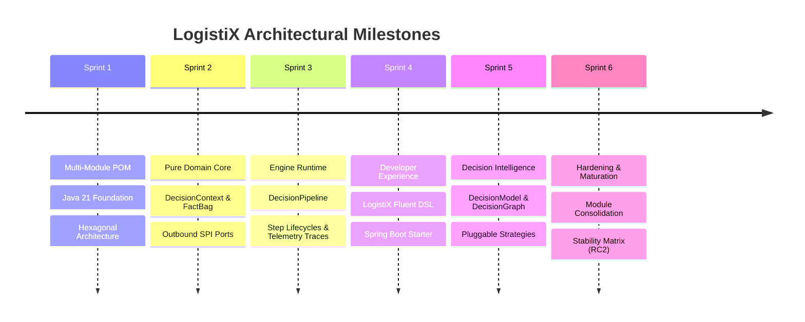

# LogistiX Project Roadmap

This document outlines the evolutionary milestones, completed architectural sprints, upcoming domain capabilities, and long-term research directions for the LogistiX Decision Intelligence Framework.

---

## 🏁 Completed Sprints (Framework Foundation)

### ✅ Sprint 1: Project Foundation
- Established Java 21 multi-module Maven structure with dependency management BOM.
- Configured baseline Hexagonal Architecture module boundaries.
- Set up Docker Compose environment with PostgreSQL 17 + `pgvector`.

### ✅ Sprint 2: Domain Layer & SPI Ports
- Renamed and purified `logistix-domain` with zero external dependencies.
- Implemented immutable records: `DecisionContext`, `FactBag`, `Fact`, `DecisionResult<T>`, `Recommendation<T>`, `Score`, `Explanation`.
- Defined Outbound SPI Ports: `AIProvider`, `KnowledgeProvider`, `RuleProvider`, `ConstraintProvider`, `ScoringProvider`.
- Added `logistix-simulation` and `logistix-benchmark` scaffolding.

### ✅ Sprint 3: Execution Engine Runtime
- Architected `logistix-engine` runtime container (`LogistiXContext`).
- Implemented immutable `DecisionPipeline` and `DecisionStep` hierarchy (`ConstraintStep`, `RuleStep`, `AIStep`, `ScoringStep`, `RecommendationStep`).
- Built nanosecond-precision `DecisionTrace` audit recording and metrics collectors.
- Established `DecisionPlugin` and `DecisionHook` lifecycle interceptors.

### ✅ Sprint 4: Developer Experience & Spring Boot Integration
- Built public API facade `LogistiX` (`decision()`, `pipeline()`, `context()`, `configure()`).
- Developed type-safe fluent DSLs (`FluentDecision`, `FluentPipeline`, `FluentContext`).
- Introduced declarative annotations: `@DecisionPipeline`, `@DecisionRule`, `@DecisionConstraint`, `@DecisionPlugin`.
- Built `logistix-spring-boot-starter` with automatic classpath scanning and `@AutoConfiguration`.

### ✅ Sprint 5: Decision Intelligence & Graph Modeling
- Architected `logistix-model` decoupling *what* executes from *how* it executes.
- Created declarative `DecisionModel`, `DecisionGraph`, `DecisionNode` taxonomy (11 specialized node types), and `DecisionEdge`.
- Defined `ExecutionStrategy` contracts (`Sequential`, `Parallel`, `Graph`, `Conditional`, `Agent`).
- Added immutable `DecisionState`, `DecisionMemory`, strongly typed `DecisionVariables`, and `ExecutionPlan` compilation.
- Implemented `DecisionVisualizer` (Mermaid, JSON, PlantUML, GraphViz) and YAML DSL schema.

### ✅ Sprint 6: Framework Hardening & Refinement (RC2)
- Consolidated redundant modules into `logistix-engine` and `logistix-spring-boot-starter`.
- Refined `logistix-common` to pure domain primitives and added `DomainAssertions`.
- Established `API_STABILITY.md` with semantic versioning guarantees.
- Ratified `CONSTITUTION.md` enshrining 10 core framework principles.

---

## 🚀 Upcoming Capabilities (Near-Term)

### 🚚 1. AI-Assisted Driver Dispatch Capability
- First reference production decision engine built on top of LogistiX.
- Real-time driver-load assignment with Hours of Service (HOS) constraints, deadhead mileage scoring, and LLM-assisted rationale synthesis.

### 🤖 2. Concrete AI Providers (`logistix-ai`)
- Spring AI adapters for OpenAI (GPT-4o), Anthropic (Claude 3.5), and Ollama (Local LLMs).
- Structured output parsers, fallback models, and token budget management.

### 📚 3. Knowledge Retrieval & RAG (`logistix-rag`)
- Vector search retriever implementation using PostgreSQL + `pgvector`.
- Semantic document chunking and domain rulebook ingestion.

### 🚦 4. Synthetic Simulator Suite (`logistix-simulation`)
- Configurable synthetic fleet, dynamic demand, and extreme weather/traffic incident simulators for stress-testing decision topologies.

### 📈 5. Decision Benchmark Harness (`logistix-benchmark`)
- Automated latency benchmarking, objective function optimization, and regression testing for decision models.

### 🎨 6. Decision Studio (Web UI)
- Interactive visual graph designer in `frontend/` for drag-and-drop decision model authoring and real-time execution replay.

---

## 🔮 Future Research & Evolution (Long-Term)

### 🌐 1. Distributed & Event-Driven Execution
- Integration with Apache Kafka and Temporal for durable, long-running decision workflows across distributed clusters.

### ☁️ 2. Cloud Native & Serverless Runnables
- GraalVM Native Image compilation for sub-10ms serverless cold starts.
- Kubernetes operator for declarative decision model CRDs.

### 🤝 3. Autonomous Multi-Agent Orchestration
- Dynamic multi-agent coordination protocols enabling autonomous negotiations (e.g. shipper agent negotiating spot rates with carrier agents).
