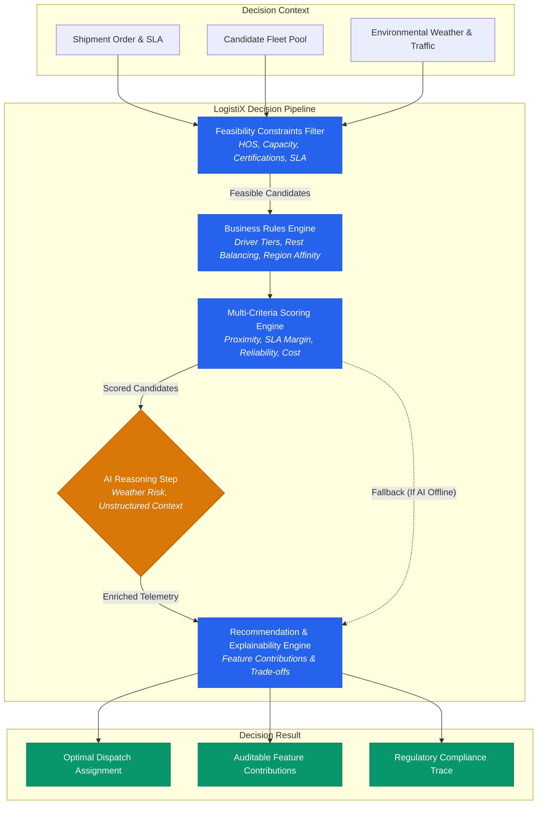

# Reference Capability: AI-Assisted Commercial Driver Dispatch

## Overview
**AI-Assisted Driver Dispatch** is the reference decision intelligence capability built on top of the **LogistiX Decision Intelligence Framework**. It illustrates how deterministic feasibility constraints, prioritized business rules, normalized multi-criteria scoring, and contextual AI reasoning work harmoniously together to solve high-consequence operational assignments in sub-millisecond latencies.



---

## 1. Core Decision Stages

### 1.1 Hard Feasibility Constraints (`Constraint<DispatchCandidate>`)
Candidates failing any hard constraint are immediately pruned with a typed `ConstraintViolation` record:
1. **Hours of Service (`HoursOfServiceConstraint`)**:
   - Ensures `driver.remainingHos() >= candidate.totalRequiredDrivingDuration()`.
2. **Vehicle Payload Capacity (`VehicleCapacityConstraint`)**:
   - Ensures `driver.vehicleWeightCapacityKg() >= shipment.weightKg()` and `driver.vehicleVolumeCapacityM3() >= shipment.volumeM3()`.
3. **Mandatory Cargo Certifications (`DriverCertificationConstraint`)**:
   - Verifies all required endorsements (e.g. `HAZMAT`, `REEFER`, `TWIC`) are held.
4. **Delivery SLA Deadline (`DeliveryDeadlineConstraint`)**:
   - Ensures estimated delivery timestamp occurs on or before the shipment delivery deadline.

### 1.2 Deterministic Business Rules (`Rule<DispatchCandidate>`)
Feasible candidates are evaluated against prioritized operational policies:
1. **Preferred Driver Incentive (`PreferredDriverRule`, Priority 100)**:
   - Grants tiered score bonuses (`PLATINUM` +0.15, `GOLD` +0.10, `SILVER` +0.05).
2. **Rest Balance & Fatigue Safeguard (`RestBalanceRule`, Priority 90)**:
   - Applies a penalty (-0.10) if driver is within 90 minutes of mandatory rest.
3. **Regional Affinity & Backhaul Incentive (`RegionalAffinityRule`, Priority 80)**:
   - Awards a bonus (+0.08) when shipment destination aligns with driver's home operating region.

### 1.3 Multi-Criteria Scoring (`ScoringEngine<DispatchCandidate>`)
Calculates a normalized composite score `[0.0, 1.0]` across balanced dimensions:
$$\text{Score} = 0.25 \cdot S_{\text{proximity}} + 0.25 \cdot S_{\text{etaMargin}} + 0.20 \cdot S_{\text{performance}} + 0.15 \cdot S_{\text{cost}} + 0.15 \cdot S_{\text{rules}}$$

| Metric Dimension | Weight | Normalization Strategy |
| :--- | :---: | :--- |
| **Deadhead Proximity** | 25% | $1.0 - (\text{Deadhead Km} / 250.0)$ |
| **ETA SLA Margin** | 25% | $\min(1.0, \text{Buffer Seconds} / 7200)$ |
| **Driver Performance** | 20% | $(\text{Rating} / 5.0) \times 0.5 + \text{OnTimeRate} \times 0.5$ |
| **Cost Efficiency** | 15% | $1.0 - (\text{Estimated Cost} / \$1500.0)$ |
| **Rule Adjustments** | 15% | $0.50 + \sum \text{Rule Adjustments}$ |

### 1.4 Contextual AI Advisor & Graceful Degradation (`AIStep`)
- Evaluates real-time weather advisories (e.g., blizzards, flash floods) and unstructured dispatcher notes.
- **Architectural Safeguard**: Marked as `optional`. If the AI provider times out or throws an exception, the decision pipeline seamlessly completes using the deterministic ranking without failure or latency disruption.

### 1.5 Recommendation & Auditable Explainability (`RecommendationStep`)
Generates a complete `Recommendation<DispatchAssignment>` including:
- **Feature Contribution Breakdown**: Directional attribution (`POSITIVE`, `NEGATIVE`, `NEUTRAL`) and impact weights.
- **Key Decision Factors**: Human-interpretable justifications.
- **Trade-Off Analysis**: Comparison against top runner-up candidates.

---

## 2. Benchmark Performance

High-throughput benchmarks across 100 simulation iterations with 20-driver candidate fleets:

| Execution Mode | Throughput | Mean Latency (p50) | Tail Latency (p95) | Feasibility Pruning Rate |
| :--- | :---: | :---: | :---: | :---: |
| **Deterministic Rules-Only** | **1,075 ops/sec** | **0.56 ms** | **1.88 ms** | 100% Correct Pruning |
| **Hybrid AI-Assisted** | **1,785 ops/sec** | **0.46 ms** | **0.88 ms** | 100% Correct Pruning |

---

## 3. How to Run the Reference Capability

### Running the Test Suite:
```bash
mvn clean test
```

### Running the Interactive Reference App:
```bash
cd examples
mvn exec:java -Dexec.mainClass="org.logistix.examples.dispatch.DriverDispatchReferenceApp"
```
