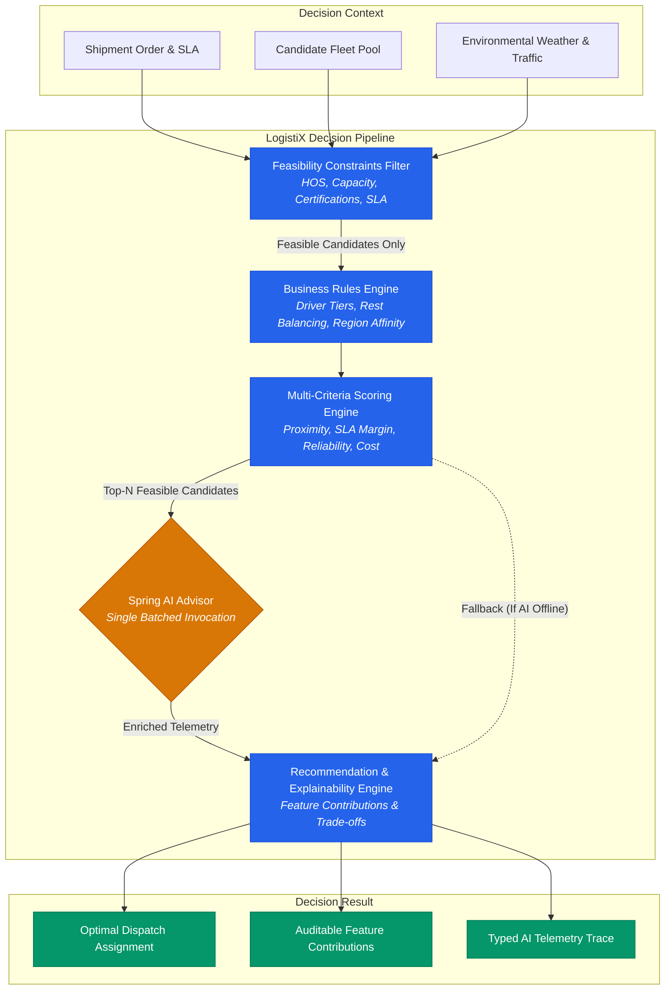

# Reference Capability: AI-Assisted Commercial Driver Dispatch

## Overview
**AI-Assisted Driver Dispatch** is the reference decision intelligence capability built on top of the **LogistiX Decision Intelligence Framework**. It illustrates how deterministic feasibility constraints, prioritized business rules, normalized multi-criteria scoring, and contextual Spring AI reasoning work harmoniously together to solve high-consequence operational assignments in sub-millisecond latencies.



---

## 1. Non-Negotiable Operational Principles

1. **AI is an Advisory Contributor, Not the Authority**: Hard operational feasibility constraints (`HoursOfServiceConstraint`, `VehicleCapacityConstraint`, `DriverCertificationConstraint`, `DeliveryDeadlineConstraint`) are strictly deterministic. An AI model **cannot** override a failed constraint or resurrect an unfeasible candidate.
2. **Context Isolation**: Only candidates passing ALL feasibility constraints are presented to the AI layer.
3. **Single Batched Call**: Multiple candidate evaluations are batched into a single Spring AI call (`DispatchAIRequest`), eliminating redundant LLM round-trips.
4. **No Direct Score Authority**: AI emits qualitative advisory signals (`riskLevel`, `advisoryConfidence`, `reasoning`, `contributingFactors`, `warnings`). LogistiX deterministic policy controls all final scores and selection.
5. **Resilient Degradation**: If the AI model times out or encounters network/parsing issues, the decision pipeline immediately falls back to deterministic decision ranking without downtime.
6. **Distinct Confidence Accounting**: AI advisory confidence (model certainty) is tracked separately from overall decision composite confidence.
7. **Explainability Demarcation**: Deterministic feature contributions (e.g. deadhead km, SLA margin) are separated from qualitative AI narrative insights.

---

## 2. Decision Pipeline Modes

LogistiX supports three operational execution modes for Driver Dispatch:

| Mode | Pipeline Topology | Primary Use Case |
| :--- | :--- | :--- |
| **`RULES_ONLY`** | Constraints $\to$ Business Rules $\to$ Scoring $\to$ Recommendation | High-throughput, offline, or low-compute deterministic dispatching. |
| **`HYBRID_MOCK`** | Constraints $\to$ Business Rules $\to$ Scoring $\to$ Mock AI $\to$ Recommendation | Local developer testing and continuous integration test suites. |
| **`HYBRID_LIVE`** | Constraints $\to$ Business Rules $\to$ Scoring $\to$ Spring AI $\to$ Recommendation | Production enterprise dispatching combining mathematical optimization with live LLM risk reasoning. |

---

## 3. Core Pipeline Stages

### 3.1 Hard Feasibility Constraints (`Constraint<DispatchCandidate>`)
Candidates failing any hard constraint are immediately pruned with a typed `ConstraintViolation` record:
1. **Hours of Service (`HoursOfServiceConstraint`)**:
   - Ensures `driver.remainingHos() >= candidate.totalRequiredDrivingDuration()`.
2. **Vehicle Payload Capacity (`VehicleCapacityConstraint`)**:
   - Ensures `driver.vehicleWeightCapacityKg() >= shipment.weightKg()` and `driver.vehicleVolumeCapacityM3() >= shipment.volumeM3()`.
3. **Mandatory Cargo Certifications (`DriverCertificationConstraint`)**:
   - Verifies all required endorsements (e.g. `HAZMAT`, `REEFER`, `TWIC`) are held.
4. **Delivery SLA Deadline (`DeliveryDeadlineConstraint`)**:
   - Ensures estimated delivery timestamp occurs on or before the shipment delivery deadline.

### 3.2 Deterministic Business Rules (`Rule<DispatchCandidate>`)
Feasible candidates are evaluated against prioritized operational policies:
1. **Preferred Driver Incentive (`PreferredDriverRule`, Priority 100)**:
   - Grants tiered score bonuses (`PLATINUM` +0.15, `GOLD` +0.10, `SILVER` +0.05).
2. **Rest Balance & Fatigue Safeguard (`RestBalanceRule`, Priority 90)**:
   - Applies a penalty (-0.10) if driver is within 90 minutes of mandatory rest.
3. **Regional Affinity & Backhaul Incentive (`RegionalAffinityRule`, Priority 80)**:
   - Awards a bonus (+0.08) when shipment destination aligns with driver's home operating region.

### 3.3 Multi-Criteria Scoring (`ScoringEngine<DispatchCandidate>`)
Calculates a normalized composite score `[0.0, 1.0]` across balanced dimensions:
$$\text{Score} = 0.25 \cdot S_{\text{proximity}} + 0.25 \cdot S_{\text{etaMargin}} + 0.20 \cdot S_{\text{performance}} + 0.15 \cdot S_{\text{cost}} + 0.15 \cdot S_{\text{rules}}$$

### 3.4 Contextual Spring AI Advisor (`SpringAIDispatchAIProvider`)
- Implements `AIProvider` SPI using Spring AI (`ChatModel`).
- Single batched evaluation of top-N feasible candidates (default `topN=3`) via `DispatchAIRequest`.
- Emits strongly typed, schema-validated structured output: `BatchedDispatchAIAdvice` and `DispatchAIAdvice`.
- Records typed `AITelemetry` (`providerName`, `modelName`, `promptVersion`, `invocationCount`, `latency`, `advisoryConfidence`, `status`).

---

## 4. Benchmark Performance & Transparency

| Mode | Provider Type | Throughput | Mean Latency (p50) | Tail Latency (p95) | Feasibility Pruning Rate |
| :--- | :--- | :---: | :---: | :---: | :---: |
| **`RULES_ONLY`** | Deterministic JVM | **1,150+ ops/sec** | **0.43 ms** | **1.87 ms** | 100% Feasibility Enforcement |
| **`HYBRID_MOCK`** | Mock AI (In-Memory) | **1,690+ ops/sec** | **0.58 ms** | **0.76 ms** | 100% Feasibility Enforcement |
| **`HYBRID_LIVE`** | Live Ollama (llama3.2) | *Model-dependent* | *~150–350 ms* | *~450–600 ms* | 100% Feasibility Enforcement |

---

## 5. How to Run

### Running Unit & Integration Tests:
```bash
mvn clean test
```

### Running the Interactive Reference App:
```bash
mvn exec:java -Dexec.mainClass="org.logistix.examples.dispatch.DriverDispatchReferenceApp" -pl :logistix-examples
```
