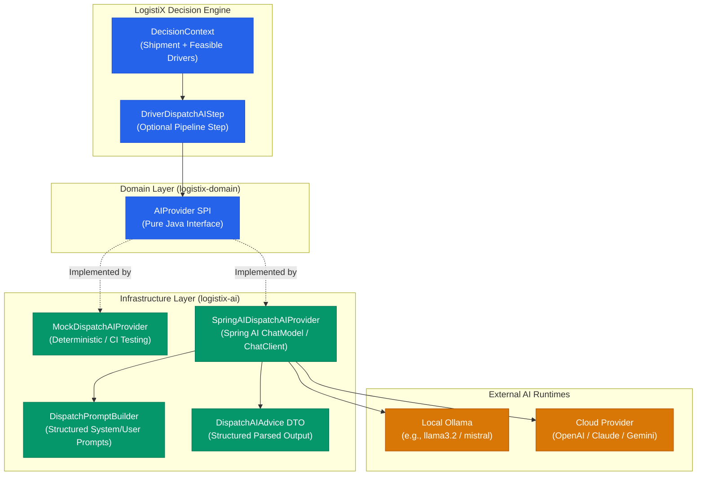

# Sprint 7.1 Baseline Verification Report: Real Spring AI Integration & Hardening

## Executive Summary
This document establishes the architecture baseline and implementation plan for **Sprint 7.1: Hardening and Completing AI Integration for Commercial Driver Dispatch**.
The goal is to transition the reference capability from simulated/heuristic AI reasoning into a **production-ready, strongly-typed Spring AI adapter**, while strictly preserving Clean Architecture, Domain-Driven Design (DDD), and Hexagonal Architecture boundaries.

---

## 1. Architectural Analysis & Module Boundaries

### 1.1 Current Architecture Review
| Layer | Existing Abstraction | Current State | Target State in Sprint 7.1 |
| :--- | :--- | :--- | :--- |
| **Domain SPI** | `AIProvider` (`logistix-domain`) | Pure Java SPI (`infer`, `generateReasoning`), clean of external dependencies. | **Preserve untouched**. Generic core must remain free of Spring AI. |
| **Infrastructure / Adapter** | `logistix-ai` | Contains generic AI models and `spring-ai-core` dependency. | Implement `SpringAIDispatchAIProvider` and structured DTOs using Spring AI `ChatModel` / `ChatClient`. |
| **Reference Capability** | `examples/dispatch` | `DispatchAIAdvisor` (simulated heuristics), `DriverDispatchAIStep`. | Refactor `DispatchAIAdvisor` to `MockDispatchAIProvider` for offline/CI tests. Integrate `SpringAIDispatchAIProvider`. |
| **Dependency Boundary** | Multi-Module Maven | `logistix-domain` depends only on standard Java & `logistix-common`. | **Enforce**: Spring AI remains strictly in `logistix-ai` and `logistix-spring-boot-starter`. |

### 1.2 Non-Negotiable Architectural Principles
1. **Deterministic Authority**: Hard constraints (`HoursOfServiceConstraint`, `VehicleCapacityConstraint`, `DriverCertificationConstraint`, `DeliveryDeadlineConstraint`) and business rules (`PreferredDriverRule`, `RestBalanceRule`, `RegionalAffinityRule`) are deterministic gatekeepers. AI is strictly advisory and **cannot override** hard feasibility failures or resurrect pruned candidates.
2. **Context Filtering**: Only candidates passing ALL hard constraints are presented to the AI layer.
3. **Graceful Fallback**: If the AI model times out, encounters network errors, or returns malformed JSON, the pipeline immediately falls back to deterministic decision ranking with zero downtime.
4. **Separation of Confidence**: AI advisory confidence (model certainty) is clearly distinguished from decision composite confidence.
5. **Separation of Explainability**: Telemetry explicitly demarcates deterministic rule/scoring contributions from qualitative AI risk narratives.
6. **Provider Agnosticism**: Supports Cloud providers (e.g. OpenAI) and Local models (e.g. Ollama via Spring AI) via external configuration without code changes.

---

## 2. Implementation Blueprint

---

## 3. Sprint 7.1 Execution Plan

1. **Structured Output DTO**: Create `DispatchAIAdvice` with candidate evaluations, risk levels, qualitative trade-offs, and advisory confidence in `logistix-ai`.
2. **Prompt Template & Builder**: Create `DispatchPromptBuilder` with strict instructions preventing constraint overrides and enforcing structured JSON schemas.
3. **Spring AI Adapter**: Implement `SpringAIDispatchAIProvider` implementing `AIProvider` using Spring AI's `ChatModel` / `ChatClient` with schema-guided output parsing.
4. **Mock Provider**: Refactor `MockDispatchAIProvider` for robust, deterministic unit/CI testing.
5. **Pipeline Refinement**: Update `DriverDispatchAIStep` and `DriverDispatchRecommendationStep` to record AI advice, structured telemetry, distinct AI confidence, and fallback traces.
6. **Configuration & Spring Boot Starter**: Enable `logistix.ai.provider` configuration (`spring-ai`, `mock`, `disabled`) with Ollama / OpenAI profile support.
7. **Benchmark Correction**: Update benchmark suites to accurately distinguish deterministic pipeline latency from real LLM API latency.
8. **Comprehensive Test Suite**: Test structured parsing, model timeout/failure fallback, hard constraint inviolability, and explainability isolation.
9. **Interactive Demo & Docs**: Update `DriverDispatchReferenceApp` and technical documentation.
